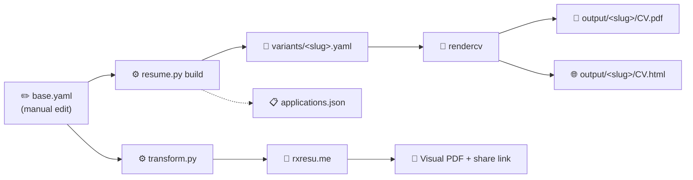
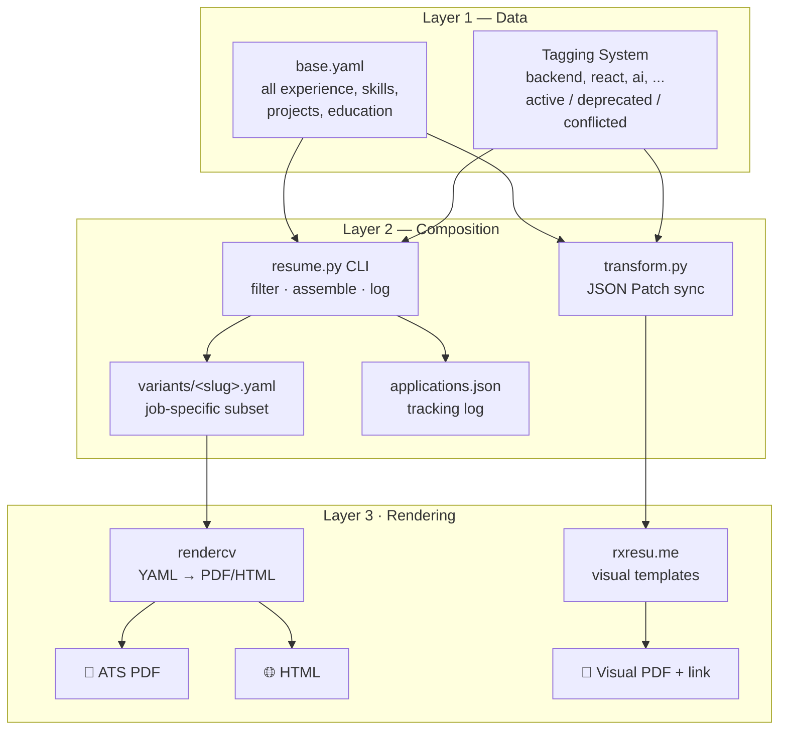

# Resume Management System

A CLI tool to maintain a **single source of truth** for your resume (`base.yaml`), compose job-specific variants, and render to **PDF + HTML** (via [rendercv](https://github.com/sinaatalay/rendercv)) or **visual resumes** (via [Reactive Resume](https://rxresu.me)).

Stop juggling 7 different resume files. Edit one YAML file — generate any variant you need.

## Quick Start

```bash
# Install dependencies
pip install -r requirements.txt

# See all available tags in your resume data
python resume.py tags

# Path A — ATS PDF via rendercv
python resume.py build \
  --company "BestIT" \
  --role "Senior SWE" \
  --tags backend,python,api \
  --template classic
# → variants/bestit-senior-swe-202606.yaml + output/.../William_Jiang_CV.pdf

# Path B — visual resume via rxresu.me
python transform.py --dry-run --all-skills
python transform.py --resume-id <YOUR_RESUME_ID> --all-skills
# → https://rxresu.me/builder/<YOUR_RESUME_ID>
```

Set `RXRESU_API_KEY` in `.env` for Path B. See [`docs/rxresume-integration-guide.md`](docs/rxresume-integration-guide.md).

## Workflow



1. **Edit `base.yaml`** — single source of truth: experience, skills, projects, education, summary, headline, cover letter templates.
2. **Choose a render path:**
   - **`resume.py build`** — tag-filtered variant → rendercv → ATS PDF/HTML, logged in `applications.json`.
   - **`transform.py`** — sync to rxresu.me for designer templates and live editing.
3. **Ship** — download PDF from `output/` or export from the rxresu.me builder.

## CLI Reference

### `python resume.py build`

Generate a job-specific resume variant and render it to PDF + HTML.

| Flag | Required | Description |
|---|---|---|
| `--company` | ✅ | Target company name |
| `--role` | ✅ | Job title |
| `--tags` | | Comma-separated tags to filter bullets (e.g. `backend,python,react`) |
| `--template` | | rendercv theme: `classic`, `sb2nov`, `moderncv`, `engineeringresumes` (default: `classic`) |
| `--jd` | | Path to a job description text file (stored in `jds/`) |
| `--llm` | | Use AI to suggest tags from the job description (requires `DEEPSEEK_API_KEY`) |

**Examples:**

```bash
# Basic — filter by tags, use classic template
python resume.py build --company "Shopify" --role "Staff Engineer" --tags fullstack,react,python

# With job description (for reference and tracking)
python resume.py build --company "Google" --role "SWE" --tags backend,python --jd jds/google-swe.txt

# With LLM tag extraction from the JD (no manual tags needed)
python resume.py build --company "Anthropic" --role "AI Engineer" --jd jds/anthropic.txt --llm
```

### `python resume.py tags`

List every tag used across your `base.yaml`. Use these tags with `--tags` in the build command.

```bash
$ python resume.py tags
ai
api
architecture
aws
backend
...
```

### `python resume.py log`

View your application history — every resume you've built, with company, role, tags, template, and output path.

```bash
$ python resume.py log

2026-06-10 — Google / SWE
  ID:       google-swe-202606
  Tags:     backend,python
  Template: classic
  Output:   output/google-swe-202606/
```

### `python transform.py` — RxResume sync

Push `base.yaml` to [rxresu.me](https://rxresu.me) for visual editing and PDF export.

| Flag | Description |
|---|---|
| `--resume-id` | PATCH an existing resume (recommended) |
| `--dry-run` | Preview JSON Patch operations without calling the API |
| `--tags` | Tag filter for experience/projects/skills (default: `fullstack,ai,react,node,python`) |
| `--all-skills` | Include all skill categories, ignore tag filter for skills |
| `--template` | RxResume template (default: `kakuna`) |
| `--max-bullets` | Cap bullets per job (default: `4`) |
| `--no-projects` | Omit projects section for a shorter resume |
| `--photo` / `--no-photo` | Control profile photo embedding |

Full reference: [`docs/rxresume-integration-guide.md`](docs/rxresume-integration-guide.md)

```bash
# Preview sync
python transform.py --dry-run --all-skills

# Sync to your dashboard resume
python transform.py --resume-id <ID> --all-skills --max-bullets 3
```

## Project Structure

```
├── base.yaml              # ★ Single source of truth — edit this
├── resume.py              # CLI composition engine (rendercv path)
├── transform.py           # RxResume sync (visual path)
├── applications.json      # Auto-generated application tracking log
├── README.md
├── .gitignore
│
├── assets/                # Source resumes + profile photo
│   ├── william-jiang.jpg  # Default headshot for rxresu.me
│   └── *.docx             # Legacy resume versions
│
├── jds/                   # Job descriptions (paste JD text here)
│   └── google-swe.txt
│
├── variants/              # Auto-generated per-application YAMLs
│   └── google-swe-202606.yaml
│
└── output/                # Auto-generated PDFs + HTML (gitignored)
    └── google-swe-202606/
        ├── William_Jiang_CV.pdf
        └── William_Jiang_CV.html
```

## How It Works



### Layer 1 — `base.yaml` (single source of truth)

Every resume bullet, skill, project, and education entry lives in `base.yaml`. Key top-level fields:

| Field | Purpose |
|---|---|
| `identity` | Name, headline, email, phone, location, URLs, photo path |
| `summary` | Short resume summary (used by both `transform.py` and `resume.py build_variant()`) |
| `experience` | Jobs with tagged bullets and status flags |
| `skills` | Grouped by category (`languages`, `frameworks`, `tools`, `ai_tools`) |
| `projects`, `education` | Tagged entries with date ranges |
| `cover_letters` | Templates for job applications (not used as resume summary by default) |

Items are **tagged** (e.g. `backend`, `react`, `ai`) and **status-flagged**:

| Status | Meaning |
|---|---|
| `active` | Current, include by default |
| `deprecated` | Old info — only include if the role needs it |
| `conflicted` | Needs resolution — never included automatically |

Nothing is deleted. Deprecated items stay in the file with a note explaining why.

### Layer 2 — Composition

| Tool | Output | Use case |
|---|---|---|
| `resume.py` | `variants/<slug>.yaml` + `applications.json` | Per-job ATS builds via rendercv |
| `transform.py` | JSON Patch → rxresu.me | Visual resume sync from same data |

Both filter by tags. Experience is sorted **newest-first** in output.

### Layer 3 — Rendering

**rendercv** (via `resume.py build`):

| Theme | Best for |
|---|---|
| `classic` | FAANG, large tech, senior roles |
| `sb2nov` | Standard SWE roles, ATS-friendly |
| `moderncv` | Startup, product, mid-level |
| `engineeringresumes` | Maximally ATS-optimised |

**rxresu.me** (via `transform.py`):

| Template | Best for |
|---|---|
| `kakuna` | Compact, high density (default) |
| `bronzor` | Tech / engineering, minimal |
| `elegant` | Senior / leadership |

See [`docs/rxresume-integration-guide.md`](docs/rxresume-integration-guide.md) for the full RxResume CLI reference.

## LLM Integration (Optional)

The `--llm` flag uses DeepSeek (or any OpenAI-compatible API) to analyze a job description and suggest the most relevant tags automatically.

```bash
export DEEPSEEK_API_KEY="sk-..."
python resume.py build --company "X" --role "Y" --jd jds/x.txt --llm
```

Fall back to local models via Ollama by swapping the endpoint in `resume.py` (`base_url="http://localhost:11434/v1"`).

The system works perfectly without LLM — `--llm` is purely additive for convenience.

## Setup

```bash
# 1. Install deps
pip install -r requirements.txt

# 2. Configure .env (optional for LLM, required for rxresu.me)
# RXRESU_API_KEY=...
# DEEPSEEK_API_KEY=...

# 3. Review the base data
python resume.py tags

# 4. Build ATS PDF
python resume.py build --company "Test" --role "Engineer" --tags backend,python

# 5. Sync visual resume (optional)
python transform.py --dry-run --all-skills
python transform.py --resume-id <ID> --all-skills

# 6. Open outputs
open output/test-engineer-202606/William_Jiang_CV.pdf
```

## Git Strategy

```
# Commit these:
base.yaml
resume.py
transform.py
applications.json
variants/
jds/

# Ignore these (already in .gitignore):
output/          # PDFs — regenerate anytime
.env             # API keys (RXRESU_API_KEY, DEEPSEEK_API_KEY)
__pycache__/
```

## Dependencies

- Python 3.11+
- [PyYAML](https://pyyaml.org/) — YAML parsing
- [rendercv](https://github.com/sinaatalay/rendercv) — PDF + HTML rendering (`resume.py`)
- [httpx](https://www.python-httpx.org/) + [Pillow](https://pillow.readthedocs.io/) — RxResume API sync + photo resize (`transform.py`)
- `openai` + `python-dotenv` (optional) — LLM tag extraction

## Reference

- Full system design: [`docs/resume-system-implementation.md`](docs/resume-system-implementation.md)
- RxResume integration: [`docs/rxresume-integration-guide.md`](docs/rxresume-integration-guide.md)
- Architecture overview: [`docs/overview.md`](docs/overview.md)
