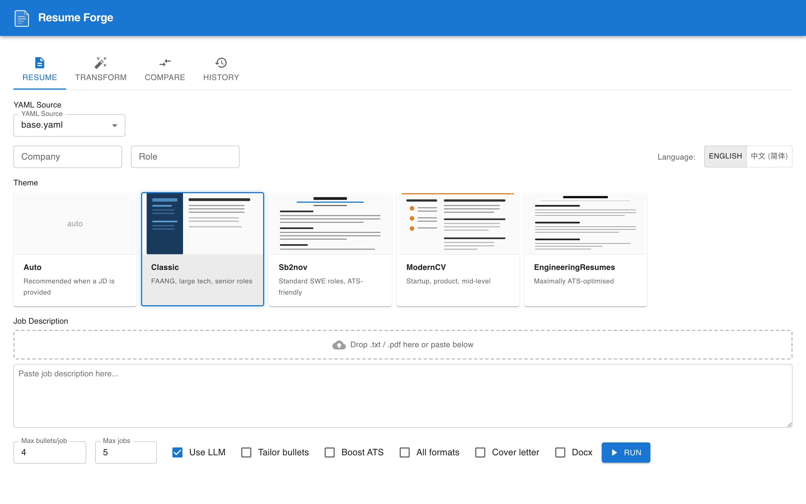
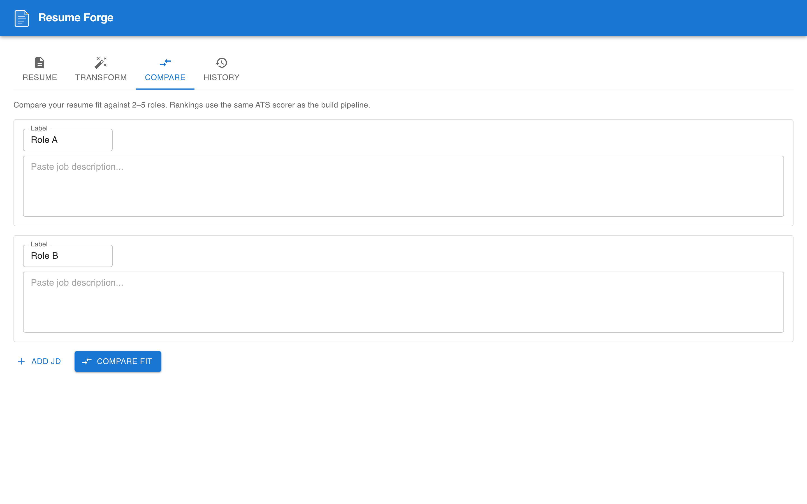
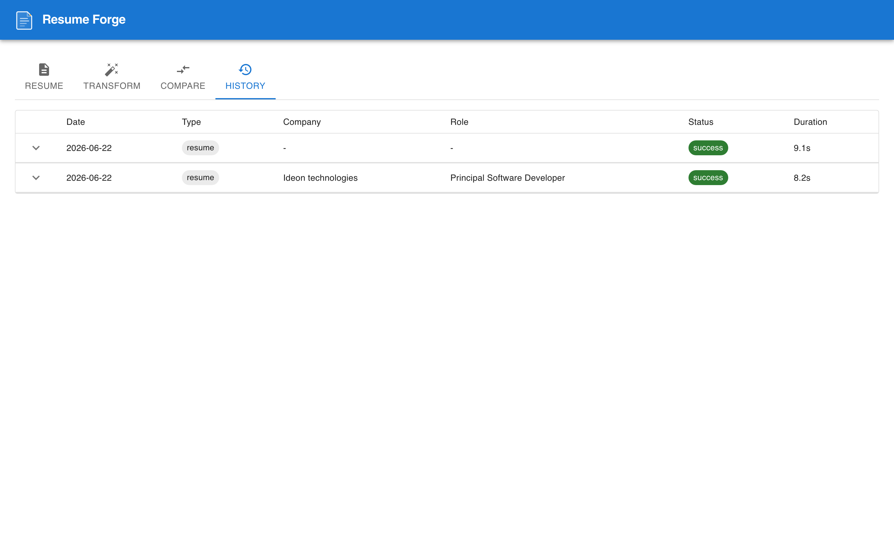
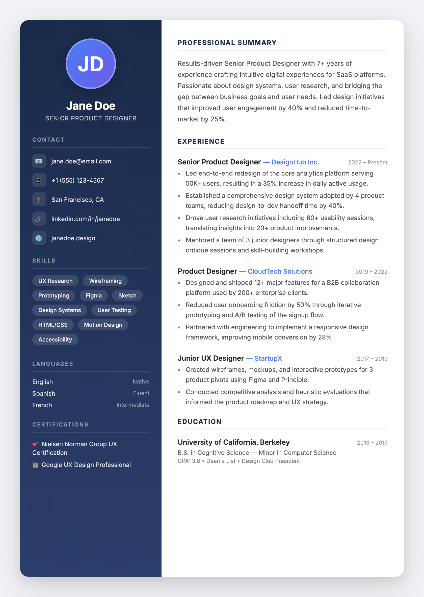
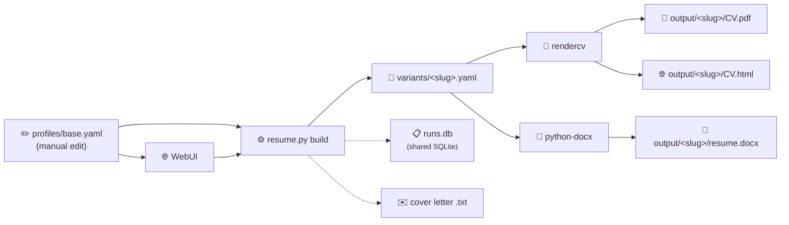
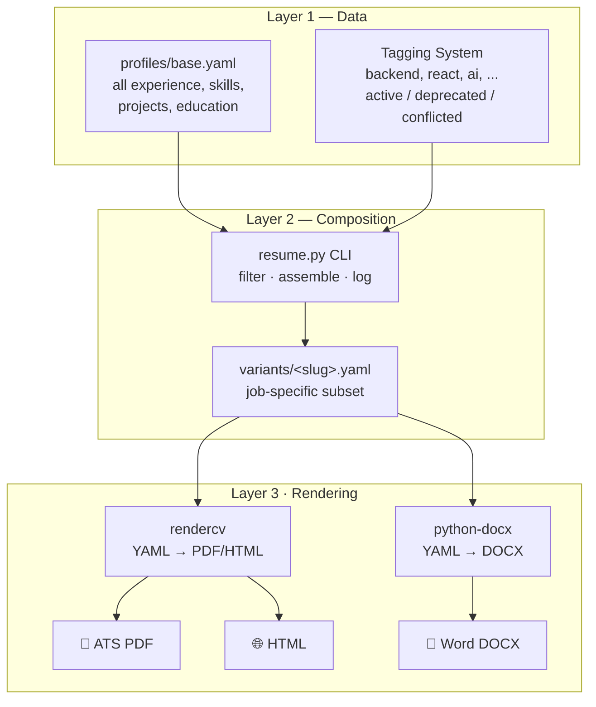

# Resume Management System

Maintain a **single source of truth** for your resume (`profiles/base.yaml`), compose job-specific variants, and render to **PDF** (via rendercv) or **DOCX** (via python-docx). Includes a local **WebUI** (FastAPI + React) for visual operation.

Stop juggling 7 different resume files. Edit one YAML file — generate any variant you need.

## Quick Start

```bash
# 1. Create a virtual environment (recommended)
python3 -m venv venv
source venv/bin/activate

# 2. Install dependencies
pip install -r requirements.txt

# 3. See all available tags in your resume data
python resume.py tags

# Path A — ATS PDF via rendercv
python resume.py build \
  --company "BestIT" \
  --role "Senior SWE" \
  --tags backend,python,api \
  --template classic
# → output/variants/bestit-senior-swe-202606.yaml + output/.../William_Jiang_CV.pdf

# Path A — with DOCX + cover letter
python resume.py build \
  --company "BestIT" \
  --role "Senior SWE" \
  --tags backend,python,api \
  --template classic \
  --docx --cover-letter
# → output/.../resume.docx + output/.../cover-letter-bestit.txt

# Path B — WebUI (local)
./ui/start.sh
# → http://localhost:5173

# Path C — JD quality pipeline (analyze → compare → build)
python resume.py compare --jds-dir jds/
python resume.py analyze --jd jds/target.txt
python resume.py build --company Acme --jd jds/target.txt \
  --llm --tailor --boost --max-bullets 3 --max-jobs 4 --template auto --pages 1
# → output/.../CV.pdf + ats-report.json + bullet-diff.json + provenance.json
```

Set `LLM_PROVIDER` + provider API keys for Path C (LLM features). See [`docs/llm-providers.md`](docs/llm-providers.md) and [`docs/resume-quality-pipeline.md`](docs/resume-quality-pipeline.md).

## Screenshots

| Resume Builder | Compare JDs | History | Editor |
|---|---|---|---|---|
|  |  |  | — |

### Generated Output Example

A beautifully designed mockup resume — the system produces real PDFs via rendercv, visual resumes via rxresu.me, and DOCX via python-docx:



## Workflow



1. **Edit `profiles/base.yaml`** — single source of truth: experience, skills, projects, education, summary, headline, cover letter templates.
2. **Choose a render path:**
   - **`resume.py build`** — tag-filtered variant → rendercv → ATS PDF/HTML, optionally DOCX + cover letter, logged in `runs.db` (shared SQLite).
   - **WebUI** ([http://localhost:5173](http://localhost:5173)) — visual interface for building resumes, storing history in the same shared `runs.db`.
3. **Ship** — download PDF from `output/`, DOCX from `output/{slug}/resume.docx`.

## CLI Reference

### `python resume.py build`

Generate a job-specific resume variant and render it to PDF + HTML, with optional DOCX and cover letter.

| Flag | Required | Description |
|---|---|---|
| `--company` | ✅ | Target company name |
| `--role` | ✅* | Job title (extracted from JD first line if omitted with `--llm`) |
| `--tags` | | Comma-separated tags to filter bullets (e.g. `backend,python,react`) |
| `--template` | | rendercv theme: `classic`, `sb2nov`, `moderncv`, `engineeringresumes`, or `auto` (default: `classic`) |
| `--yaml` | | YAML source file (default: `profiles/base.yaml`) |
| `--locale` | | Resume language: `en` or `zh-CN` (default: `en`) |
| `--jd` | ** | Path to a job description text file (required with `--llm`) |
| `--max-bullets` | | Max bullets per job (default: `4`; `0` = unlimited) |
| `--max-jobs` | | Max experience entries (default: `0` = unlimited) |
| `--llm` | | Use AI to suggest tags, rewrite headline, and rewrite summary (requires API key + `--jd`) |
| `--llm-provider` | | Override provider: `deepseek`, `kimi`, or `minimax` (default: `LLM_PROVIDER` in `.env`) |
| `--tailor` | | LLM minimally rewrite selected bullets for JD alignment (requires `--jd` + API key) |
| `--boost` | | Second LLM pass: add verified missing JD skills to bullets + skills section |
| `--pages` | | Page budget — trim to fit N pages (default: `1`; `0` = no trim) |
| `--no-projects` | | Omit projects section (helps one-page budget) |
| `--target-score` | | Re-run with tailor+boost if ATS score below target (e.g. `75`) |
| `--all-formats` | | Generate HTML, Markdown, and PNG in addition to PDF |
| `--cover-letter` | | Also generate a cover letter .txt file |
| `--docx` | | Also generate a .docx Word document |

\* `--role` still required when NOT using `--llm`\
\*\* `--jd` required when using `--llm`

**Examples:**

```bash
# Basic — filter by tags, use classic template
python resume.py build --company "Shopify" --role "Staff Engineer" --tags fullstack,react,python

# With job description (for reference and tracking)
python resume.py build --company "Google" --role "SWE" --tags backend,python --jd jds/google-swe.txt

# With LLM tag extraction + headline + summary rewrite from the JD
# (--role is optional — extracted from JD first line)
python resume.py build --company "Anthropic" --jd jds/anthropic.txt --llm

# Full quality pipeline: LLM + bullet tailor + ATS boost + one-page budget
python resume.py build --company "BestIT" --jd jds/bestit.txt --llm --tailor --boost \
  --max-bullets 3 --max-jobs 4 --template auto --pages 1 --target-score 75 --docx

# With DOCX + cover letter
python resume.py build --company "BestIT" --role "Senior SWE" --tags backend,python --docx --cover-letter

# Chinese resume (requires base_zh.yaml + Noto Sans CJK font)
python resume.py build --company "BestIT" --role "高级工程师" --yaml base_zh.yaml --locale zh-CN --docx
```

### `python resume.py tags`

List every tag used across your `profiles/base.yaml`. Use these tags with `--tags` in the build command.

```bash
$ python resume.py tags
ai
api
architecture
aws
backend
...
```

### `python resume.py log`

View your application history from the shared SQLite database — every build from CLI or WebUI, with status, timing, and generated output files.

```bash
$ python resume.py log

2026-06-25 — Google / SWE
  ID:       google-swe-202606
  Tags:     backend,python
  Template: classic
  ATS:      87/100 (A) (was 72, +15)
  Status:   success
  Duration: 12.3s
  Files:    William_Jiang_CV.pdf, resume.docx
```

Both CLI builds and WebUI builds appear in the same log.

### `python resume.py analyze`

Parse a JD against `profiles/base.yaml`: hard skills, matched/missing skills, top-scored bullets.

```bash
python resume.py analyze --jd jds/target.txt
python resume.py analyze --jd jds/target.txt --json
```

### `python resume.py score`

Deterministic ATS compatibility score (/100) without building a PDF.

```bash
python resume.py score --jd jds/target.txt --tags backend,python --max-bullets 3
python resume.py score --jd jds/target.txt --variant variants/acme-role-202606.yaml
python resume.py score --jd jds/target.txt --output score-report.json
```

### `python resume.py interview`

Gap analysis and interview prep from a JD — strengths, missing skills, STAR story prompts, optional LLM Q&A outlines.

```bash
python resume.py interview --jd jds/target.txt --tags ai,python
python resume.py interview --jd jds/target.txt --llm --json
```

### `python resume.py compare`

Rank 2–5 JDs by resume fit — use to decide which roles to apply to first.

```bash
python resume.py compare --jd jds/role-a.txt jds/role-b.txt
python resume.py compare --jds-dir jds/ --max-bullets 3 --max-jobs 4
python resume.py compare --jds-dir jds/ --output compare-report.json
```

Full reference: [`docs/resume-quality-pipeline.md`](docs/resume-quality-pipeline.md)

### `python resume.py cover-letter`

Generate a cover letter from a `profiles/base.yaml` template, with optional LLM rewrite.

| Flag | Required | Description |
|---|---|---|
| `--company` | ✅ | Target company name |
| `--role` | | Job title (extracted from JD first line if omitted with `--llm`) |
| `--tags` | | Comma-separated tags to select cover letter template (e.g. `ai,fullstack` or `backend,api`) |
| `--jd` | | Path to job description text file |
| `--llm` | | Use AI to rewrite the cover letter body to match the JD (requires `DEEPSEEK_API_KEY` + `--jd`) |
| `--output` | | Write to file instead of stdout |

```bash
# Using the ai-fullstack-focused template
python resume.py cover-letter --company "Ideon" --role "Principal Dev" --tags ai,fullstack

# With LLM rewrite to match the job description
python resume.py cover-letter --company "Ideon" --jd jds/adam-green.txt --tags ai,fullstack --llm

# Write to file instead of stdout
python resume.py cover-letter --company "Ideon" --role "Principal Dev" --output cover-letter-ideon.txt
```

### `python resume.py llm-providers`

List configured LLM providers, base URLs, models, and whether each API key is set.

```bash
python resume.py llm-providers
```

See [`docs/llm-providers.md`](docs/llm-providers.md) for Kimi (Moonshot) and MiniMax China inland endpoints.

### `scripts/cleanup.sh`

Reset all generated data — output, runs.db — for a fresh test.

```bash
./scripts/cleanup.sh
```

### `scripts/screenshot_ui.py`

Capture screenshots of the WebUI (all 5 tabs) and the latest output PDF using Playwright. Saved to `docs/imgs/`.

```bash
pip install playwright pdf2image
python -m playwright install chromium
python scripts/screenshot_ui.py
```

Requires the WebUI backend and frontend dependencies (`pip install -r requirements.txt` + `cd ui/frontend && npm install`).

## WebUI

A local web interface wraps the CLI tools for visual operation. No auth — localhost only.

### Prerequisites

```bash
pip install -r requirements.txt   # includes FastAPI, uvicorn, etc.
cd ui/frontend && npm install && cd ../..
```

### Start

```bash
./ui/start.sh
```

Opens [http://localhost:5173](http://localhost:5173). The Vite dev server proxies `/api` requests to the FastAPI backend on port 8000.

### Pages

| Page | Path | Preview | Description |
|---|---|---|---|
| **Resume** | `/` |  | Build: JD analysis, bullet preview, ATS widget, bullet diff, tailor/boost re-run, auto theme |
| **Compare** | `/compare` |  | Paste 2–5 JDs, ranked ATS fit table with missing skills |
| **History** | `/history` |  | Run log with ATS scores, status, logs, and output links |
| **Editor** | `/editor` | — | Direct YAML editor with CodeMirror 6: edit any `profiles/*.yaml` file with syntax highlighting, save with backup |

## Project Structure

```
├── profiles/                # ★ Resume profile YAML files (base*.yaml)
│   ├── base.yaml            #   Single source of truth — edit this
│   ├── base-v2.yaml
│   ├── base-v1.yaml
│   ├── base-zh.yaml         #   Chinese variant
│   └── base-2-zh.yaml
├── resume.py                # CLI entry point (thin wrapper → src/cli.py)
├── src/                     # ★ Core Python modules
│   ├── cli.py               #   CLI composition engine (~1900 lines)
│   ├── compose.py           #   Shared bullet ranking + caps
│   ├── jd_parser.py         #   Structured JD keyword parsing
│   ├── ats.py               #   Deterministic ATS scoring + multi-JD compare
│   ├── llm_pipeline.py      #   LLM JD parse + hybrid bullet rescoring
│   ├── llm_config.py        #   Multi-provider LLM config (deepseek / kimi / minimax)
│   ├── tailor_validation.py #   Anti-hallucination checks for tailor rewrites
│   ├── page_budget.py       #   One-page line estimator + trim loop
│   ├── provenance.py        #   provenance.json per build (source refs)
│   └── history_db.py        #   Shared SQLite DB for CLI + WebUI history
├── runs.db                   # SQLite database (shared by CLI + WebUI)
├── requirements.txt
├── README.md
├── .gitignore
│
├── assets/                  # Source resumes + profile photo
│   └── *.docx               # Legacy resume versions
│
├── jds/                     # Job descriptions (paste JD text here)
│   └── google-swe.txt
│
├── variants/                # Auto-generated per-application YAMLs
│   └── google-swe-202606.yaml
│
├── output/                  # Auto-generated PDFs + DOCX + HTML (gitignored)
│   └── google-swe-202606/
│       ├── William_Jiang_CV.pdf
│       ├── William_Jiang_CV.html
│       ├── resume.docx
│       ├── cover-letter-google.txt
│       ├── ats-report.json
│       ├── bullet-diff.json
│       ├── page-budget.json
│       └── provenance.json
│
├── scripts/
│   └── cleanup.sh           # Reset all generated data
│
├── ui/                      # WebUI (FastAPI + React + Vite)
│   ├── start.sh             # One-command launcher
│   ├── backend/
│   │   ├── main.py          # FastAPI app (API routes)
│   │   ├── models.py        # Pydantic request/response schemas
│   │   ├── runner.py        # Async subprocess job runner
│   │   ├── db.py            # Thin async wrapper around src/history_db.py
│   │   ├── jd_analyzer.py   # JD keyword extraction
│   │   ├── theme_data.py    # Rendercv themes
│   └── frontend/
│       ├── src/
│       │   ├── App.tsx          # Tab navigation (Resume / Transform / Compare / History / Editor)
│       │   ├── api/client.ts    # API client
│       │   ├── types.ts         # TypeScript interfaces
│       │   ├── pages/
│       │   │   ├── ResumePage.tsx
│       │   │   ├── TransformPage.tsx
│       │   │   ├── ComparePage.tsx
│       │   │   ├── HistoryPage.tsx
│       │   │   └── EditorPage.tsx    # YAML editor with CodeMirror
│       │   └── components/
│       │       ├── JdAnalysisPanel.tsx
│       │       ├── BulletPreviewPanel.tsx
│       │       ├── AtsScoreWidget.tsx
│       │       ├── BulletDiffView.tsx
│       │       ├── ThemeCard.tsx       # Rendercv theme picker with SVG preview
│       │       ├── LogStream.tsx       # SSE log display
│       │       ├── JdInput.tsx         # JD text + file upload
│       │       ├── YamlSelector.tsx    # YAML file dropdown
│       │       ├── TagChips.tsx        # Keyword tag display
│       │       └── Logo.tsx           # App logo
│       ├── index.html
│       └── package.json
│
└── docs/
    ├── resume-quality-pipeline.md   # JD pipeline, ATS scoring, tailor/boost (NEW)
    ├── overview.md                  # Architecture overview
    ├── resume-system-implementation.md
    └── superpowers/
        ├── specs/            # Design specs
        └── plans/            # Implementation plans
```

## How It Works



### Layer 1 — `profiles/base.yaml` (single source of truth)

Every resume bullet, skill, project, and education entry lives in `profiles/base.yaml`. Key top-level fields:

| Field | Purpose |
|---|---|
| `identity` | Name, headline, email, phone, location, URLs, photo path |
| `summary` | Short resume summary (used by `resume.py build_variant()`) |
| `experience` | Jobs with tagged bullets, optional `variants[]`, `metrics[]`, `keywords[]`, and status flags |
| `skills` | Grouped by category (`languages`, `frameworks`, `tools`, `ai_tools`) |
| `projects`, `education` | Tagged entries with date ranges |
| `cover_letters` | Templates for job applications (not used as resume summary by default) |

Items are **tagged** (e.g. `backend`, `react`, `ai`) and **status-flagged**:

| Status | Meaning |
|---|---|
| `active` | Current, include by default |
| `deprecated` | Old info — only include if the role needs it |
| `conflicted` | Needs resolution — never included automatically |

Nothing is deleted. Deprecated items stay in the file with a note explaining why.

### Layer 2 — Composition

| Tool | Output | Use case |
|---|---|---|
| `resume.py` | `output/variants/<slug>.yaml` + optional `.docx` + optional cover letter `.txt` | Per-job ATS builds via rendercv, DOCX for recruiters, cover letter |
Both filter by tags. Experience is sorted **newest-first** in output.

### Layer 3 — Rendering

**rendercv** (via `resume.py build`):

| Theme | Best for |
|---|---|
| `classic` | FAANG, large tech, senior roles |
| `sb2nov` | Standard SWE roles, ATS-friendly |
| `moderncv` | Startup, product, mid-level |
| `engineeringresumes` | Maximally ATS-optimised |

**python-docx** (via `resume.py build --docx`):
- Output: `output/{slug}/resume.docx`
- Font: Calibri (universal), dark-blue section headers, bullet lists
- Ready for Google Docs / Word — no formatting required

### Locale / Language

Toggle between English and 中文 (Simplified Chinese) via `--locale`:

```bash
# English (default)
python resume.py build --company "X" --role "Engineer" --tags backend

# Chinese — requires base_zh.yaml and Noto Sans SC font
python resume.py build --company "X" --role "工程师" --yaml base_zh.yaml --locale zh-CN
```

- Langauge toggle switches the rendercv font (`Source Sans 3` → `Noto Sans SC` for CJK support)
- In the WebUI, toggling language auto-switches to the corresponding YAML file
- Create `profiles/base_zh.yaml` for Chinese content — same schema as `profiles/base.yaml`

## LLM Integration (Optional)

The `--llm` flag uses DeepSeek (or any OpenAI-compatible API) to analyze a job description and suggest the most relevant tags automatically.

```bash
export DEEPSEEK_API_KEY="sk-..."
python resume.py build --company "X" --role "Y" --jd jds/x.txt --llm
```

Fall back to local models via Ollama by swapping the endpoint in `resume.py` (`base_url="http://localhost:11434/v1"`).

The system works perfectly without LLM — `--llm` is purely additive for convenience.

## Setup

See [`docs/resources.md`](docs/resources.md) for detailed environment setup.

```bash
# 1. Create virtual environment (recommended)
python3 -m venv venv
source venv/bin/activate

# 2. Install deps
pip install -r requirements.txt

# 3. Configure .env (optional — only needed for --llm features)
cp .env.example .env
# Edit .env: set LLM_PROVIDER and the corresponding API key (DeepSeek / Kimi / MiniMax)

# 4. Review the base data
python resume.py tags

# 5. Build ATS PDF
python resume.py build --company "Test" --role "Engineer" --tags backend,python

# 6. Open outputs
open output/test-engineer-*/William_Jiang_CV.pdf
```

## Git Strategy

```
# Commit these:
profiles/base.yaml
resume.py
src/                   # All core Python modules
runs.db                # SQLite history (shared by CLI + WebUI)
jds/

# Ignore these (already in .gitignore):
output/          # Generated PDFs/DOCX/variants — regenerate anytime
assets/          # Personal files (photos, legacy resumes)
.env             # API keys
__pycache__/
```

## Dependencies

- Python 3.11+
- [PyYAML](https://pyyaml.org/) — YAML parsing
- [rendercv](https://github.com/sinaatalay/rendercv) — PDF + HTML rendering (`resume.py`)
- [python-docx](https://python-docx.readthedocs.io/) — DOCX generation (`resume.py --docx`)
- `openai` + `python-dotenv` (optional) — LLM tag extraction
- **WebUI**: `fastapi`, `uvicorn[standard]`, `aiosqlite`, `sse-starlette`, `pypdf`, `python-multipart`

## Reference

- **Dev setup & environment:** [`docs/resources.md`](docs/resources.md)
- **Quality pipeline (analyze, score, compare, tailor, boost):** [`docs/resume-quality-pipeline.md`](docs/resume-quality-pipeline.md)
- **LLM providers (DeepSeek, Kimi, MiniMax):** [`docs/llm-providers.md`](docs/llm-providers.md)
- **YAML Editor tab design spec:** [`docs/superpowers/specs/2026-06-25-yaml-editor-tab-design.md`](docs/superpowers/specs/2026-06-25-yaml-editor-tab-design.md)
- Full system design: [`docs/resume-system-implementation.md`](docs/resume-system-implementation.md)
- Architecture overview: [`docs/overview.md`](docs/overview.md)
