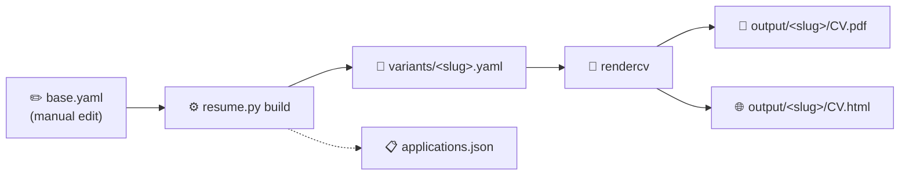
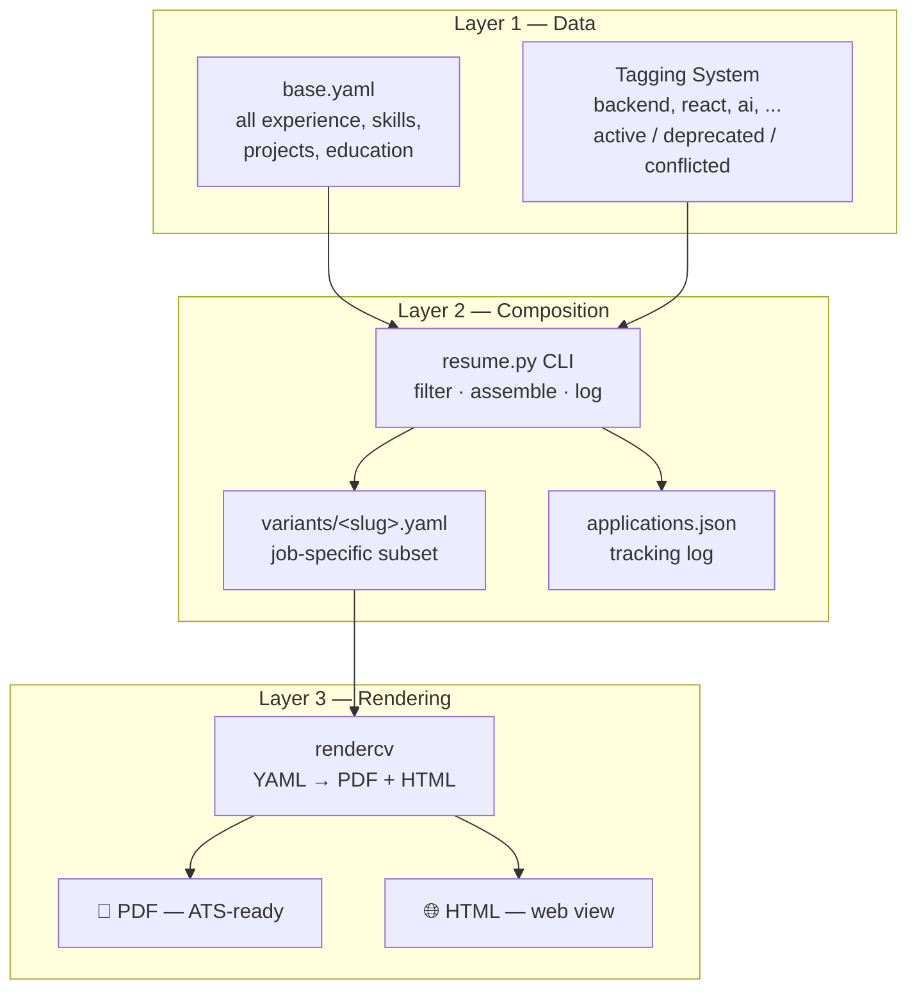

# Resume Management System

A 3-layer CLI tool to maintain a **single source of truth** for your resume (`base.yaml`), compose job-specific variants, and render PDF + HTML via [rendercv](https://github.com/sinaatalay/rendercv).

Stop juggling 7 different resume files. Edit one YAML file — generate any variant you need.

## Quick Start

```bash
# Install dependencies
pip install pyyaml rendercv

# See all available tags in your resume data
python resume.py tags

# Build a PDF for a specific role
python resume.py build \
  --company "BestIT" \
  --role "Senior SWE" \
  --tags backend,python,api \
  --template classic

# Output: variants/bestit-senior-swe-202606.yaml + output/bestit-senior-swe-202606/William_Jiang_CV.pdf
```

## Workflow



1. **Edit `base.yaml`** — maintain your single source of truth: all experience, skills, projects, education, and cover letter templates in one tagged YAML file.
2. **Run `resume.py build`** — the CLI filters content by keyword tags, assembles a job-specific variant, renders it via rendercv, and logs the application.
3. **Ship the PDF** — your ATS-friendly, role-tailored resume is ready in `output/`.

## CLI Reference

### `python resume.py build`

Generate a job-specific resume variant and render it to PDF + HTML.

| Flag | Required | Description |
|---|---|---|
| `--company` | ✅ | Target company name |
| `--role` | ✅ | Job title |
| `--tags` | | Comma-separated tags to filter bullets (e.g. `backend,python,react`) |
| `--template` | | rendercv theme: `classic`, `sb2nov`, `moderncv`, `engineeringresumes` (default: `classic`) |
| `--jd` | | Path to a job description text file (stored in `jds/`) |
| `--llm` | | Use AI to suggest tags from the job description (requires `DEEPSEEK_API_KEY`) |

**Examples:**

```bash
# Basic — filter by tags, use classic template
python resume.py build --company "Shopify" --role "Staff Engineer" --tags fullstack,react,python

# With job description (for reference and tracking)
python resume.py build --company "Google" --role "SWE" --tags backend,python --jd jds/google-swe.txt

# With LLM tag extraction from the JD (no manual tags needed)
python resume.py build --company "Anthropic" --role "AI Engineer" --jd jds/anthropic.txt --llm
```

### `python resume.py tags`

List every tag used across your `base.yaml`. Use these tags with `--tags` in the build command.

```bash
$ python resume.py tags
ai
api
architecture
aws
backend
...
```

### `python resume.py log`

View your application history — every resume you've built, with company, role, tags, template, and output path.

```bash
$ python resume.py log

2026-06-10 — Google / SWE
  ID:       google-swe-202606
  Tags:     backend,python
  Template: classic
  Output:   output/google-swe-202606/
```

## Project Structure

```
├── base.yaml              # ★ Single source of truth — edit this
├── resume.py              # CLI composition engine
├── applications.json      # Auto-generated application tracking log
├── README.md
├── .gitignore
│
├── jds/                   # Job descriptions (paste JD text here)
│   └── google-swe.txt
│
├── variants/              # Auto-generated per-application YAMLs
│   └── google-swe-202606.yaml
│
└── output/                # Auto-generated PDFs + HTML (gitignored)
    └── google-swe-202606/
        ├── William_Jiang_CV.pdf
        └── William_Jiang_CV.html
```

## How It Works



### Layer 1 — `base.yaml` (single source of truth)

Every resume bullet, skill, project, and education entry lives in `base.yaml`. Items are **tagged** with keywords (e.g. `backend`, `react`, `ai`, `devops`) and **status-flagged**:

| Status | Meaning |
|---|---|
| `active` | Current, include by default |
| `deprecated` | Old info — only include if the role needs it |
| `conflicted` | Needs resolution — never included automatically |

Nothing is deleted. Deprecated items stay in the file with a note explaining why.

### Layer 2 — `resume.py` (composition engine)

The CLI reads `base.yaml`, filters sections by your chosen tags, and writes a clean `variants/<slug>.yaml` in rendercv's schema. It also logs the application to `applications.json` so you can track what went where.

### Layer 3 — rendercv (rendering)

rendercv converts the variant YAML to PDF + HTML. Templates:

| Theme | Best for |
|---|---|
| `classic` | FAANG, large tech, senior roles |
| `sb2nov` | Standard SWE roles, ATS-friendly |
| `moderncv` | Startup, product, mid-level |
| `engineeringresumes` | Maximally ATS-optimised |

## LLM Integration (Optional)

The `--llm` flag uses DeepSeek (or any OpenAI-compatible API) to analyze a job description and suggest the most relevant tags automatically.

```bash
export DEEPSEEK_API_KEY="sk-..."
python resume.py build --company "X" --role "Y" --jd jds/x.txt --llm
```

Fall back to local models via Ollama by swapping the endpoint in `resume.py` (`base_url="http://localhost:11434/v1"`).

The system works perfectly without LLM — `--llm` is purely additive for convenience.

## Setup

```bash
# 1. Install deps
pip install pyyaml rendercv

# 2. Review the base data
python resume.py tags

# 3. Make your first resume
python resume.py build --company "Test" --role "Engineer" --tags backend,python

# 4. Open the PDF
open output/test-engineer-202606/William_Jiang_CV.pdf
```

## Git Strategy

```
# Commit these:
base.yaml
resume.py
applications.json
variants/
jds/

# Ignore these (already in .gitignore):
output/          # PDFs — regenerate anytime
.env             # API keys
__pycache__/
```

## Dependencies

- Python 3.11+
- [PyYAML](https://pyyaml.org/) — YAML parsing
- [rendercv](https://github.com/sinaatalay/rendercv) — PDF + HTML rendering
- `openai` (optional) — LLM tag extraction

## Reference

Full system design: [`docs/resume-system-implementation.md`](docs/resume-system-implementation.md)
