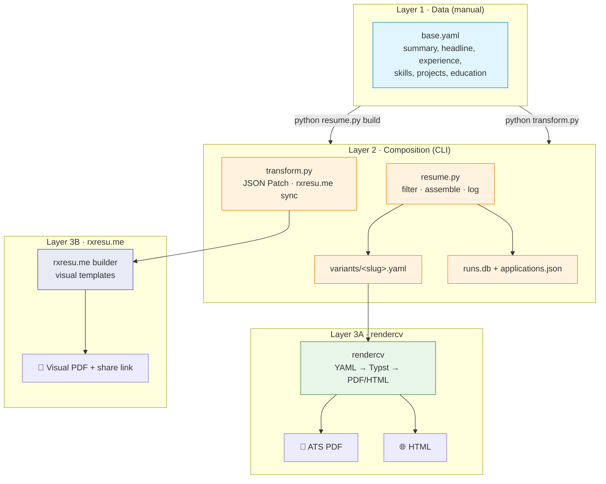
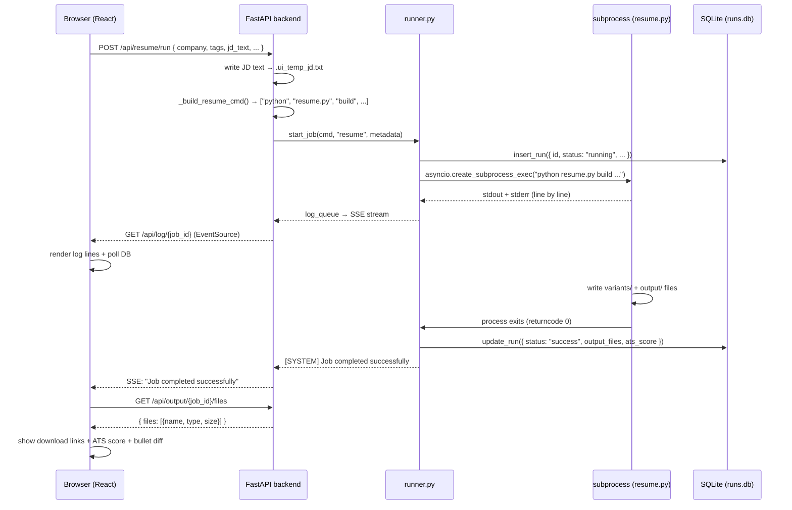
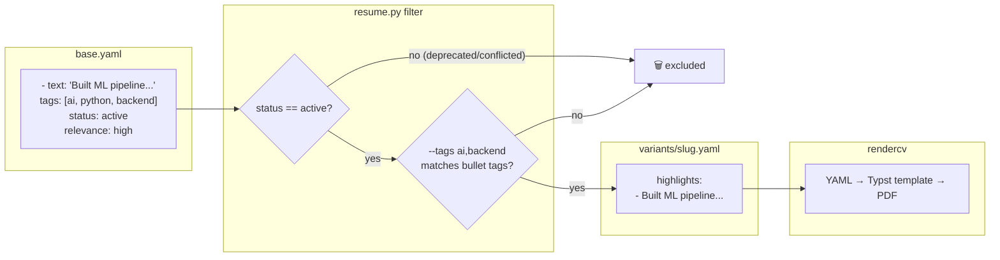
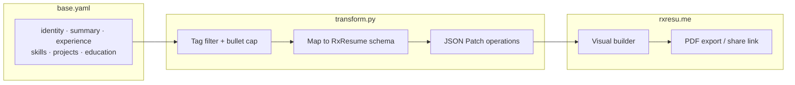
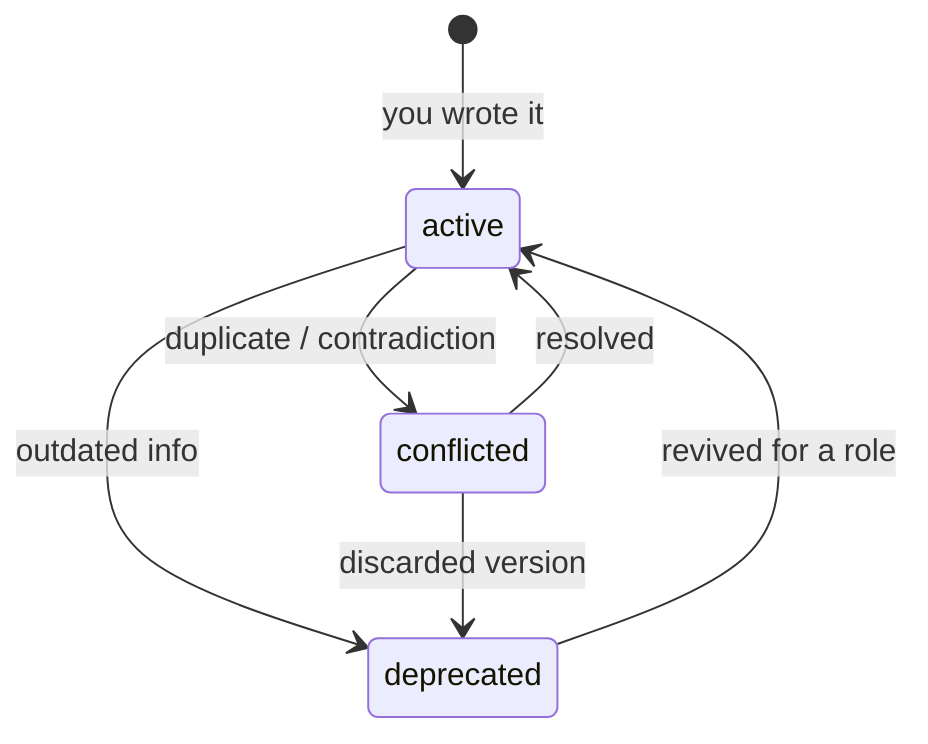
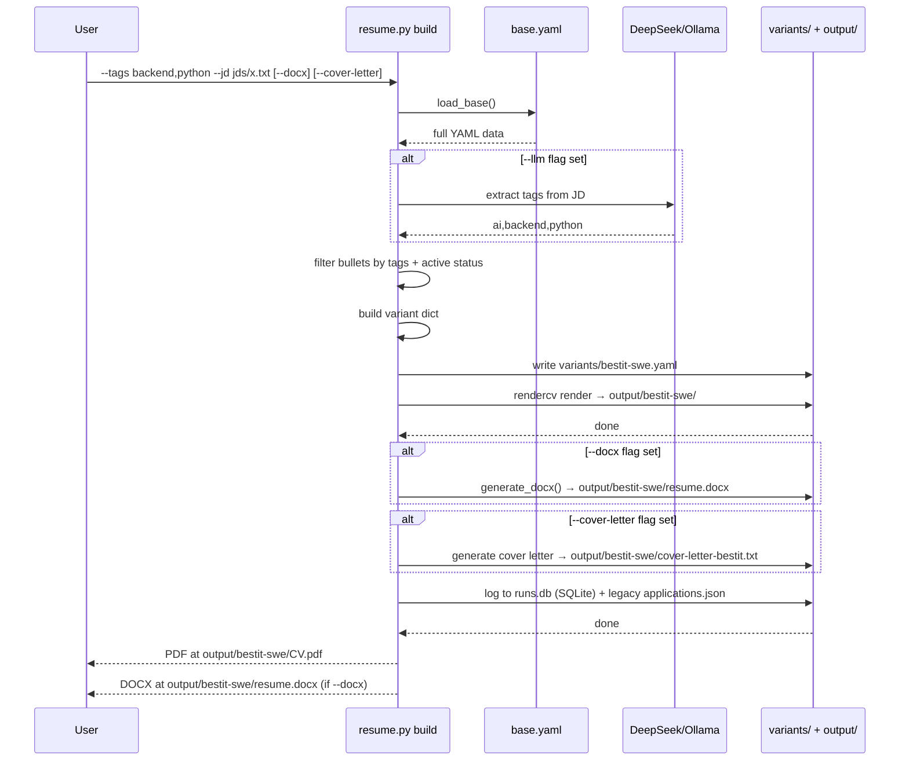
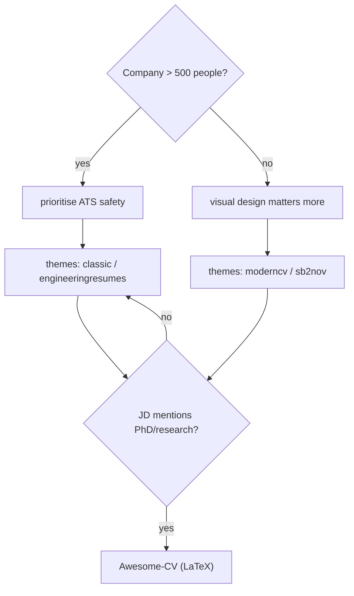
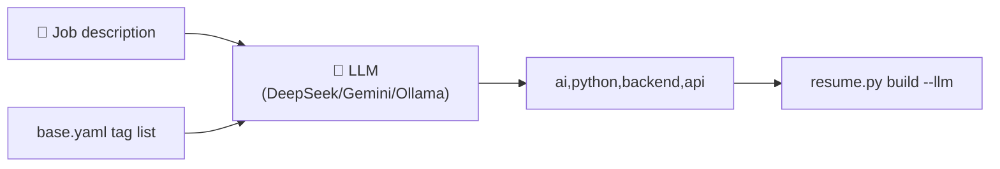
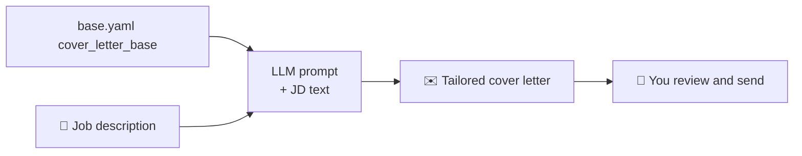
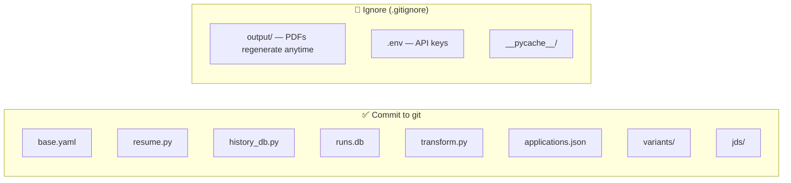

# Resume Management System — Overview

> **Note:** The RxResume/`transform.py` path described in this document has been removed (July 2026). References to `transform.py`, `rxresu.me`, `/api/transform/run`, and `TransformPage.tsx` are historical only. The core pipeline (`resume.py` → rendercv / python-docx) and WebUI (Resume, Compare, Outputs, History, Editor tabs) remain active.

> **One YAML to rule them all.** Maintain a single source of truth in `base.yaml`, compose job-specific variants with tag-based filtering, and render to **ATS PDFs** (rendercv) — all from the CLI.

---

## Architecture

The system has three data/composition layers and **two rendering paths**:



### Layer boundaries

| Layer | Edits | Tools | Output |
|---|---|---|---|
| **Layer 1** — `base.yaml` | Manual only | — | Tagged YAML data |
| **Layer 2** — Composition | Never manually | `resume.py`, `transform.py`, **WebUI** | Variant YAML, JSON Patch ops, or direct CLI invocation |
| **Layer 3A** — rendercv | Never manually | rendercv CLI | ATS PDF, HTML |
| **Layer 3B** — python-docx | Never manually | python-docx | Word DOCX |
| **Layer 3C** — rxresu.me | Tweak in UI | rxresu.me dashboard | Visual PDF, public link |

The key rule: **`base.yaml` is the only file you touch by hand.** Everything else is generated or synced on demand.

### When to use which path

| Need | Command | Output |
|---|---|---|
| Job application, ATS scan | `resume.py build --tags ...` | `output/<slug>/William_Jiang_CV.pdf` |
| Recruiter prefers Word | `resume.py build --tags ... --docx` | `output/<slug>/resume.docx` |
| Visual polish, templates, sharing | `transform.py --resume-id ...` | rxresu.me builder + PDF export |
| Both PDF + DOCX + cover letter | `resume.py build --docx --cover-letter` | All three in one command |
| Chinese resume | `resume.py build --locale zh-CN --yaml base_zh.yaml` | PDF + DOCX with CJK font |
| Visual UI for everything | `./ui/start.sh` then open http://localhost:5173 | WebUI with all options |

---

## WebUI Architecture

The WebUI (`ui/`) is a React frontend + FastAPI backend that wraps `resume.py` as a **subprocess** — it never imports or calls it directly.

### Request flow



### Layer breakdown

| Layer | Tech | Role |
|---|---|---|
| **Frontend** | React + Vite + MUI, `EventSource` for SSE logs | Form UI, real-time log streaming, result display |
| **Backend API** | FastAPI (`main.py`) | HTTP endpoints, command construction, job orchestration |
| **Runner** | `runner.py` | Async subprocess lifecycle (start, monitor, cancel) |
| **Subprocess** | `resume.py build ...` (separate Python process) | Actual composition + rendercv rendering |
| **DB** | SQLite (`runs.db`) via `history_db.py` | Shared run history between CLI + WebUI |

### Key design decisions

- **Subprocess, not import.** The API builds a CLI command string and spawns `resume.py` in a child process. This keeps the CLI and WebUI fully independent — no shared global state, no import side effects.
- **Async log streaming.** `runner.py` reads stdout/stderr from the subprocess line-by-line and pushes each line into an `asyncio.Queue`. The SSE endpoint (`GET /api/log/{job_id}`) consumes the queue and pushes events to the browser.
- **Dual completion detection.** The frontend listens to both the SSE stream (`[SYSTEM] Job completed successfully`) **and** polls `GET /api/history/{job_id}` every 1s. This ensures reliable detection even if the SSE connection drops.
- **Cancellation via `asyncio.CancelledError`.** The `cancel_job()` call cancels the asyncio task, which triggers `proc.kill()` on the subprocess.
- **Shared DB.** Both `resume.py` (CLI) and `runner.py` (WebUI) write to the same `runs.db` via `history_db.py`, so the History tab shows all runs regardless of origin.

### File mapping

| Frontend file | Purpose |
|---|---|
| `ui/frontend/src/pages/ResumePage.tsx` | Build form, run button, log + output display |
| `ui/frontend/src/pages/TransformPage.tsx` | RxResume sync form |
| `ui/frontend/src/api/client.ts` | `api.runResume()`, `api.streamLogs()`, etc. |
| `ui/frontend/src/components/LogStream.tsx` | Real-time log viewer (SSE) |

| Backend file | Purpose |
|---|---|
| `ui/backend/main.py` | FastAPI routes: `run_resume()`, `_build_resume_cmd()` |
| `ui/backend/runner.py` | `start_job()`, `_run_process()`, `stream_logs()`, `cancel_job()` |
| `ui/backend/models.py` | `ResumeRunRequest` Pydantic schema |
| `ui/backend/db.py` | SQLite operations (shared with CLI via `history_db.py`) |

---

## `base.yaml` schema highlights

Beyond tagged experience/skills/projects, the source file now includes fields used by both render paths:

| Field | Example | Used by |
|---|---|---|
| `identity.headline` | `Senior Full-Stack & AI Engineer \| ...` | `transform.py` → rxresu.me |
| `identity.photo` | `assets/william-jiang.jpg` | `transform.py` → embedded headshot |
| `summary` | Short professional paragraph | `transform.py` (default summary source) |
| `education[].start` + `graduation` | `1987-09` → `1991-07` | Full date ranges in output |
| `cover_letters[]` | Role-specific letter bodies | Applications only (`--use-cover-letter` for rxresu.me) |

Experience is stored oldest→newest in YAML; both CLIs **output newest-first**.

---

## Data flow (rendercv path)

This diagram traces a single bullet from `base.yaml` through to the final PDF:



---

## Data flow (rxresu.me path)



Key transform behaviors:

- **Skills grouped** by category (4 rows, keyword tags) — not 36 individual rated rows
- **Profiles hidden** — links live in the header
- **Photo** resized and embedded as JPEG data URL
- **`--all-skills`** bypasses tag filter for the skills section only

Full CLI reference: [`rxresume-integration-guide.md`](rxresume-integration-guide.md)

---

## The tagging system

Tags are the glue that connects job requirements to your resume content. Every bullet, skill, and project in `base.yaml` carries tags describing its domain.

### Tag usage


### Available tags

Run `python resume.py tags` to see every tag in your `base.yaml`. Typical tags include:

```
ai, api, architecture, aws, backend, ci/cd, devops, docker,
frontend, fullstack, java, kubernetes, leadership, ml, node,
python, react, rag, typescript
```

### Status flags

Each item has a `status` field with three possible values:



| Status | Include by default | Use case |
|---|---|---|
| `active` | ✅ Yes | Current, accurate, role-relevant content |
| `deprecated` | ❌ No | Old jobs, outdated tech, superseded URLs — kept for reference |
| `conflicted` | 🛑 Never | Two versions exist for the same thing — fix before use |

Nothing is ever deleted from `base.yaml`. Deprecated items stay with a `note` explaining why, preserving full history.

---

## CLI deep dive

### `python resume.py build` — the core command



### All commands

| Command | Purpose |
|---|---|
| `python resume.py build --company X --role Y --tags backend,python` | Build and render an ATS resume via rendercv |
| `python resume.py build --docx --cover-letter` | Build + DOCX + cover letter |
| `python resume.py build --locale zh-CN --yaml base_zh.yaml` | Build Chinese resume with CJK font |
| `python resume.py tags` | List all available tags in `base.yaml` |
| `python resume.py log` | Show application history |
| `python resume.py cover-letter --company X --role Y` | Generate a cover letter standalone |
| `python resume.py analyze --jd jds/x.txt` | Structured JD parse + skill match report |
| `python resume.py score --jd jds/x.txt` | ATS compatibility score (/100) |
| `python resume.py score --variant variants/foo.yaml --jd jds/x.txt` | Score a built variant YAML |
| `python resume.py interview --jd jds/x.txt` | Gap analysis + interview prep |
| `python resume.py compare --jds-dir jds/` | Rank 2–5 JDs by resume fit |
| `python resume.py build --llm --tailor --boost --template auto --pages 1` | Full quality pipeline build |
| `python transform.py --resume-id <ID> --template auto --jd jds/x.txt` | RxResume sync with auto template |
| `./scripts/cleanup.sh` | Reset all generated data (variants, output, DB) |

### `build` flags

| Flag | Required | Description |
|---|---|---|---|
| `--company` | ✅ | Target company name (used in slug + log) |
| `--role` | ✅ | Job title |
| `--tags` | | Comma-separated tag filter (e.g. `backend,python,react`) |
| `--template` | | rendercv theme: `classic`, `sb2nov`, `moderncv`, `engineeringresumes` (default: `classic`) |
| `--yaml` | | YAML source file (default: `base.yaml`) |
| `--locale` | | Resume language: `en` or `zh-CN` (default: `en`) |
| `--jd` | | Path to a job description text file (saved in `jds/` for reference) |
| `--max-bullets` | | Max bullets per job (default: 4) |
| `--max-jobs` | | Max experience entries (default: 0 = unlimited) |
| `--llm` | | Enable LLM-based tag extraction + headline + summary from the JD |
| `--tailor` | | LLM minimally rewrite bullets for JD (requires `--jd` + API key) |
| `--boost` | | Second LLM pass for verified missing hard skills |
| `--pages` | | Page budget — trim to N pages (default: 1) |
| `--target-score` | | Re-run with tailor+boost if ATS below threshold |
| `--template auto` | | Pick rendercv theme from JD signals |
| `--all-formats` | | Generate HTML, Markdown, and PNG in addition to PDF |
| `--cover-letter` | | Also generate a cover letter .txt file |
| `--docx` | | Also generate a .docx Word document |

### Slug convention

The variant file name is auto-generated:

```
{company}-{role}-{YYYYMM}.yaml

Examples:
  bestit-senior-swe-202606.yaml
  google-swe-202606.yaml
  shopify-staff-engineer-202607.yaml
```

---

## Project structure

```
resume-app/
├── base.yaml                 # ★ Single source of truth — you edit this
├── resume.py                 # CLI composition engine (rendercv path)
├── history_db.py              # Shared SQLite DB module (CLI + WebUI)
├── runs.db                    # Shared history database (tracked)
├── compose.py                # Shared bullet ranking + caps
├── jd_parser.py              # Structured JD keyword parsing
├── ats.py                    # ATS scoring + multi-JD compare
├── transform.py              # RxResume sync (visual path)
├── applications.json         # Legacy tracking log (still written for backward compat)
├── README.md
├── .gitignore
│
├── assets/                   # Source resumes + profile photo
│   ├── william-jiang.jpg     # Default headshot (rxresu.me)
│   └── *.docx                # Legacy resume versions
│
├── jds/                      # Job descriptions
├── variants/                 # Auto-generated rendercv YAMLs
├── output/                   # Auto-generated PDFs + DOCX + HTML (gitignored)
├── scripts/
│   └── cleanup.sh            # Reset all generated data
├── ui/                       # WebUI (FastAPI + React/Vite)
│   ├── start.sh              # One-command launcher
│   ├── backend/              # Python API
│   └── frontend/             # React + Vite app
└── docs/
    ├── overview.md           # This document
    ├── resume-quality-pipeline.md  # JD pipeline, ATS, tailor/boost
    ├── rxresume-integration-guide.md
    ├── resume-system-implementation.md
    └── superpowers/
        ├── specs/            # Design specs
        └── plans/            # Implementation plans
```

---

## Template selection



| Role type | Recommended template |
|---|---|
| FAANG / big tech / senior | `classic` or `engineeringresumes` |
| Standard SWE, ATS priority | `engineeringresumes` or `sb2nov` |
| Startup / product / mid-level | `moderncv` or `sb2nov` |
| Academic / research | Awesome-CV (LaTeX external) |

---

## LLM integration

LLM is purely optional. The system works without it. When enabled, it helps at two points:

### 1. JD tag extraction



The LLM reads the JD and your available tags, then returns the most relevant ones. This replaces manual `--tags` selection.

### 2. Cover letter drafting (manual process)



### Provider options

| Provider | Model | Cost | Privacy |
|---|---|---|---|
| DeepSeek | `deepseek-v4-pro` | ~$0.001/resume | Cloud |
| Google | Gemini 2.0 Flash | Free tier | Cloud |
| Ollama (local) | Llama 3.1 8B | Free | ✅ Local |
| OpenAI | GPT-4o mini | ~$0.01 | Cloud |

Add these to `.env` (auto-loaded by `python-dotenv`):

```env
# Optional — LLM tag extraction (resume.py --llm)
DEEPSEEK_API_KEY=sk-...
DEEPSEEK_BASE_URL=https://api.deepseek.com
DEEPSEEK_MODEL=deepseek-v4-pro

# Required for transform.py → rxresu.me
RXRESU_API_KEY=your_key_here
```

Swap `DEEPSEEK_BASE_URL` for another OpenAI-compatible provider (e.g. Ollama, OpenAI) — no code changes needed.

---

## Git strategy



The `.gitignore` is already configured — you don't need to think about this.

---

## Quick start

```bash
# 1. Install dependencies
pip install -r requirements.txt

# 2. Review existing tags
python resume.py tags

# 3. Build ATS PDF
python resume.py build \
  --company "BestIT" \
  --role "Senior SWE" \
  --tags backend,python,api \
  --template classic

# 4. Open the PDF
open output/bestit-senior-swe-202606/William_Jiang_CV.pdf

# 5. Sync to rxresu.me (optional)
python transform.py --dry-run --all-skills
python transform.py --resume-id <YOUR_ID> --all-skills --max-bullets 3

# 6. Check the log
python resume.py log
```

---

## Key design principles

1. **Single source of truth.** All resume data lives in `base.yaml`. Generated files are disposable — rebuild them anytime.
2. **Tags, not copies.** Instead of maintaining N resume files, maintain one file with tagged bullets. The CLI assembles the right subset per job.
3. **Nothing gets deleted.** Deprecated and conflicted entries stay in `base.yaml` with notes. You preserve full history.
4. **Deterministic builds.** Same `base.yaml` + same tags = same output, every time.
5. **LLM is additive.** The tag system works manually. LLM is an accelerator, not a dependency.
6. **Everything is plain text.** YAML, JSON, Markdown, Python. No databases, no binary formats, no vendor lock-in.

---

## Reference

- **Quality pipeline:** [`resume-quality-pipeline.md`](resume-quality-pipeline.md)
- Full system design: [`resume-system-implementation.md`](resume-system-implementation.md)
- RxResume integration: [`rxresume-integration-guide.md`](rxresume-integration-guide.md)
- User identity & links: [`init.md`](init.md)
- RenderCV docs: <https://docs.rendercv.com>
- Reactive Resume docs: <https://docs.rxresu.me>
