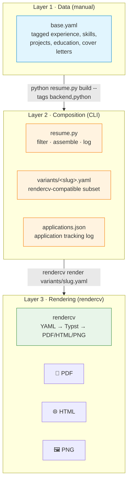
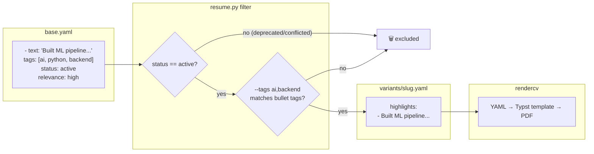
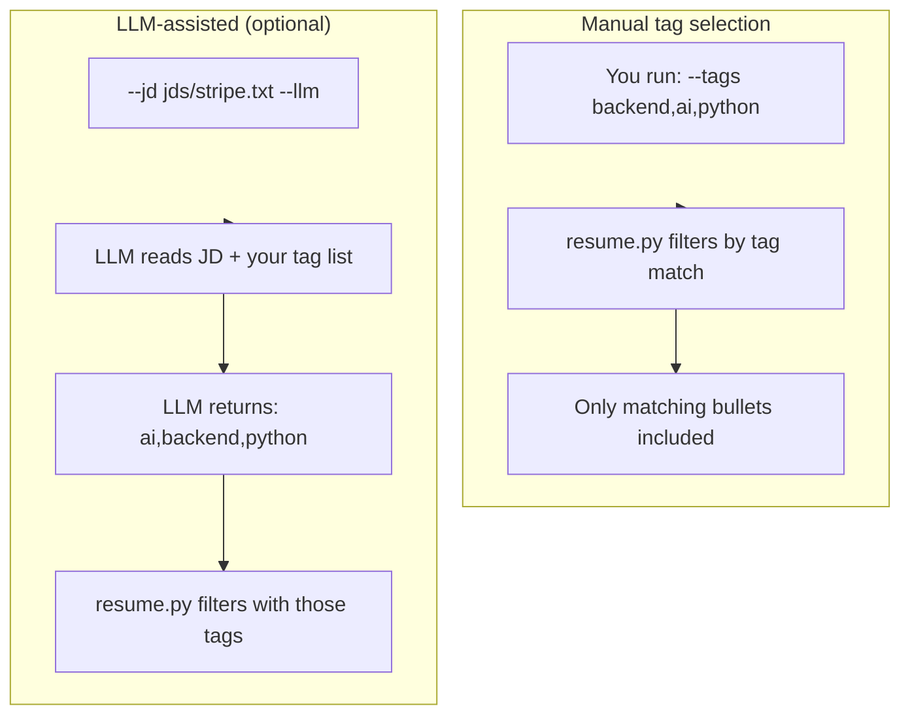
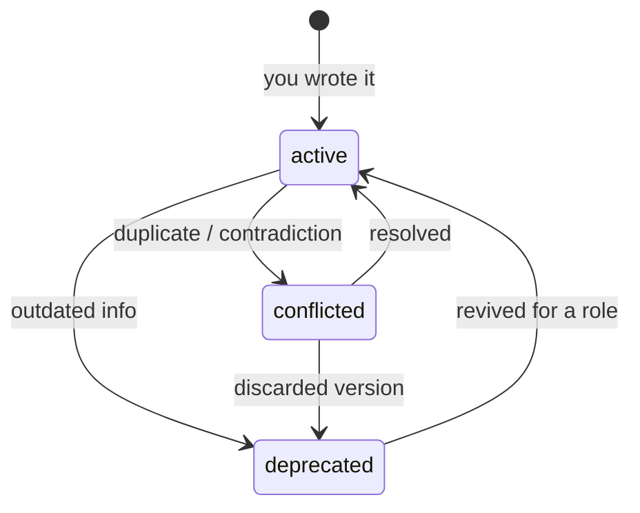
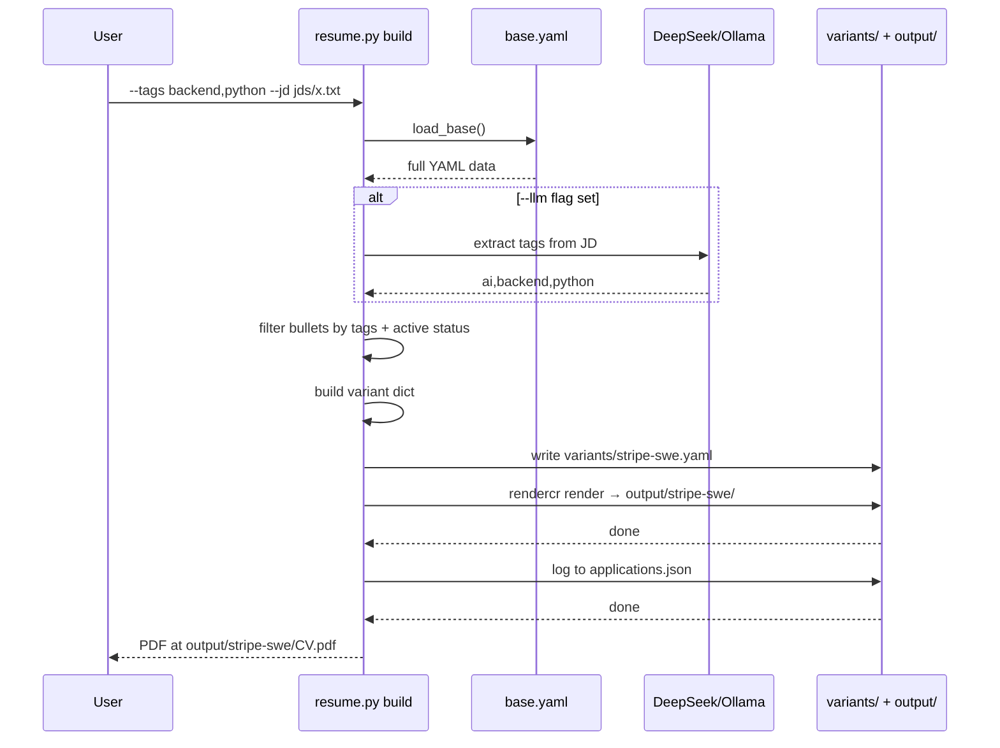
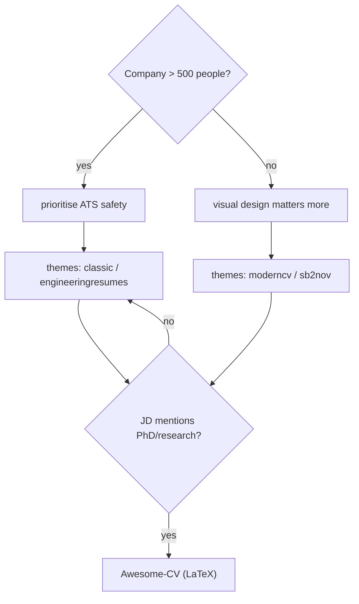
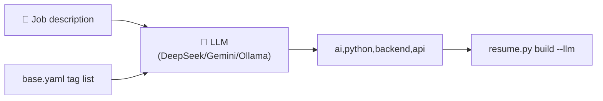
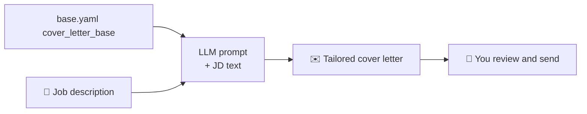
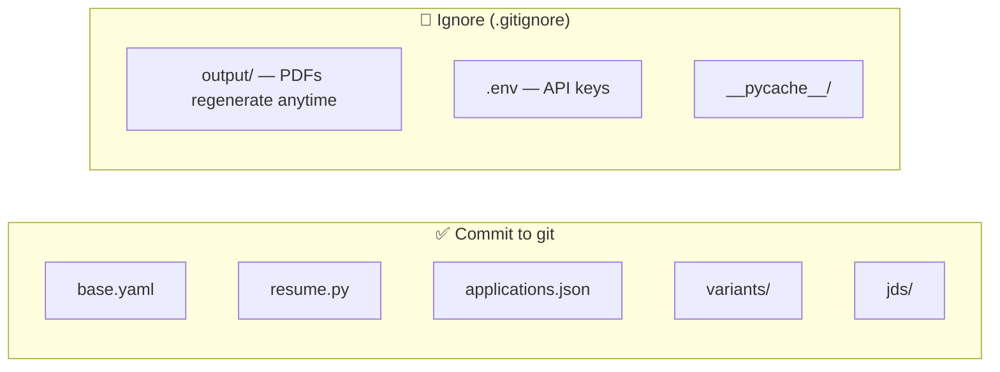

# Resume Management System — Overview

> **One YAML to rule them all.** Stop maintaining N different resumes for every job application. Maintain a single source of truth, compose job-specific variants with tag-based filtering, and render professional PDFs — all from the CLI.

---

## Architecture

The system has three independent layers. Each layer has a single responsibility and a well-defined contract with the others.



### Layer boundaries

| Layer | Edits | Automation | Output |
|---|---|---|---|
| **Layer 1** — `base.yaml` | Manual only | None — you write everything | Tagged YAML data |
| **Layer 2** — `resume.py` | Never manually | CLI filters + assembles + logs | Variant YAML + JSON log |
| **Layer 3** — rendercv | Never manually | Converts variant to final format | PDF, HTML, PNG |

The key rule: **base.yaml is the only file you touch by hand.** Everything else is generated on demand.

---

## Data flow

This diagram traces a single bullet from `base.yaml` through to the final PDF:



---

## The tagging system

Tags are the glue that connects job requirements to your resume content. Every bullet, skill, and project in `base.yaml` carries tags describing its domain.

### Tag usage



### Available tags

Run `python resume.py tags` to see every tag in your `base.yaml`. Typical tags include:

```
ai, api, architecture, aws, backend, ci/cd, devops, docker,
frontend, fullstack, java, kubernetes, leadership, ml, node,
python, react, rag, typescript
```

### Status flags

Each item has a `status` field with three possible values:



| Status | Include by default | Use case |
|---|---|---|
| `active` | ✅ Yes | Current, accurate, role-relevant content |
| `deprecated` | ❌ No | Old jobs, outdated tech, superseded URLs — kept for reference |
| `conflicted` | 🛑 Never | Two versions exist for the same thing — fix before use |

Nothing is ever deleted from `base.yaml`. Deprecated items stay with a `note` explaining why, preserving full history.

---

## CLI deep dive

### `python resume.py build` — the core command



### All commands

| Command | Purpose |
|---|---|
| `python resume.py build --company X --role Y --tags backend,python` | Build and render a job-specific resume |
| `python resume.py tags` | List all available tags in `base.yaml` |
| `python resume.py log` | Show your full application history |

### `build` flags

| Flag | Required | Description |
|---|---|---|
| `--company` | ✅ | Target company name (used in slug + log) |
| `--role` | ✅ | Job title |
| `--tags` | | Comma-separated tag filter (e.g. `backend,python,react`) |
| `--template` | | rendercv theme: `classic`, `sb2nov`, `moderncv`, `engineeringresumes` (default: `classic`) |
| `--jd` | | Path to a job description text file (saved in `jds/` for reference) |
| `--llm` | | Enable LLM-based tag extraction from the JD |

### Slug convention

The variant file name is auto-generated:

```
{company}-{role}-{YYYYMM}.yaml

Examples:
  stripe-senior-swe-202606.yaml
  google-swe-202606.yaml
  shopify-staff-engineer-202607.yaml
```

---

## Project structure

```
resume-app/
├── base.yaml                 # ★ Single source of truth — you edit this
├── resume.py                 # CLI composition engine
├── applications.json         # Auto-generated application tracking log
├── README.md
├── .gitignore
│
├── jds/                      # Job descriptions (paste JD text here)
│   ├── stripe-swe.txt
│   └── google-swe.txt
│
├── variants/                 # Auto-generated per-application YAMLs
│   ├── stripe-senior-swe-202606.yaml
│   └── google-swe-202606.yaml
│
├── output/                   # Auto-generated PDFs + HTML (gitignored)
│   ├── stripe-senior-swe-202606/
│   │   ├── William_Jiang_CV.pdf
│   │   ├── William_Jiang_CV.html
│   │   └── William_Jiang_CV.md
│   └── google-swe-202606/
│       └── William_Jiang_CV.pdf
│
├── docs/
│   ├── overview.md           # This document
│   └── resume-system-implementation.md  # Full system design spec
│
└── assets/                   # Raw resume files being consolidated
    ├── William Jiang - Senior FullStack Engineer.docx
    └── ...
```

---

## Template selection



| Role type | Recommended template |
|---|---|
| FAANG / big tech / senior | `classic` or `engineeringresumes` |
| Standard SWE, ATS priority | `engineeringresumes` or `sb2nov` |
| Startup / product / mid-level | `moderncv` or `sb2nov` |
| Academic / research | Awesome-CV (LaTeX external) |

---

## LLM integration

LLM is purely optional. The system works without it. When enabled, it helps at two points:

### 1. JD tag extraction



The LLM reads the JD and your available tags, then returns the most relevant ones. This replaces manual `--tags` selection.

### 2. Cover letter drafting (manual process)



### Provider options

| Provider | Model | Cost | Privacy |
|---|---|---|---|
| DeepSeek | `deepseek-chat` | ~$0.001/resume | Cloud |
| Google | Gemini 2.0 Flash | Free tier | Cloud |
| Ollama (local) | Llama 3.1 8B | Free | ✅ Local |
| OpenAI | GPT-4o mini | ~$0.01 | Cloud |

Set `DEEPSEEK_API_KEY` in your environment, or swap the endpoint in `resume.py` for another provider.

---

## Git strategy



The `.gitignore` is already configured — you don't need to think about this.

---

## Quick start

```bash
# 1. Install dependencies
pip install pyyaml rendercv

# 2. Review existing tags
python resume.py tags

# 3. Build your first resume
python resume.py build \
  --company "Stripe" \
  --role "Senior SWE" \
  --tags backend,python,api \
  --template classic

# 4. Open the PDF
open output/stripe-senior-swe-202606/William_Jiang_CV.pdf

# 5. Check the log
python resume.py log
```

---

## Key design principles

1. **Single source of truth.** All resume data lives in `base.yaml`. Generated files are disposable — rebuild them anytime.
2. **Tags, not copies.** Instead of maintaining N resume files, maintain one file with tagged bullets. The CLI assembles the right subset per job.
3. **Nothing gets deleted.** Deprecated and conflicted entries stay in `base.yaml` with notes. You preserve full history.
4. **Deterministic builds.** Same `base.yaml` + same tags = same output, every time.
5. **LLM is additive.** The tag system works manually. LLM is an accelerator, not a dependency.
6. **Everything is plain text.** YAML, JSON, Markdown, Python. No databases, no binary formats, no vendor lock-in.

---

## Reference

- Full system design: [`resume-system-implementation.md`](resume-system-implementation.md)
- User identity & links: [`init.md`](init.md)
- RenderCV docs: <https://docs.rendercv.com>
