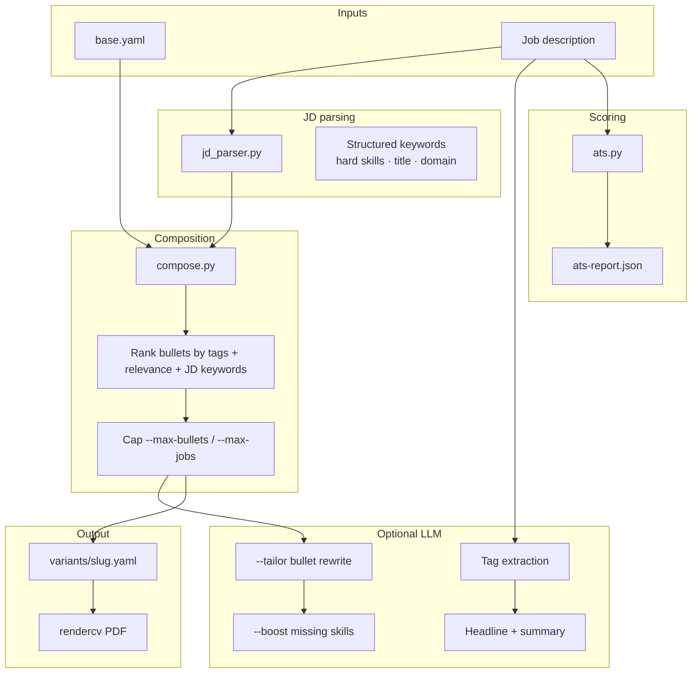

# Resume Quality Pipeline — Implementation Guide

> JD-driven composition, ATS scoring, LLM tailoring, and multi-role comparison.
> Implemented June 2026. Extends the base 3-layer system described in [`resume-system-implementation.md`](resume-system-implementation.md).

---

## Overview

The quality pipeline sits between **Layer 1** (`base.yaml`) and **Layer 3** (rendercv / DOCX). It makes resumes more **accurate** (verified facts only), **concise** (ranked + capped bullets), and **powerful** (JD-aligned headline, summary, and bullets).



---

## LLM Features (Enhance / Tailor / Boost)

All three require `--llm` and a JD to work against.

| Option | Flag | What it does |
|---|---|---|
| **Enhance** | `--enhance` | LLM rewrites bullet descriptions to be more impactful/compelling — rephrases using stronger action verbs and quantifies results where possible, but sticks strictly to verified `base.yaml` content (no fabrication) |
| **Tailor** | `--tailor` | LLM minimally rewrites bullets to better match the specific JD — adjusts terminology, emphasis, and framing to align with the job posting's language, while passing through a hallucination validator that rejects fabricated claims |
| **Boost** | `--boost` | Second LLM pass after build — identifies missing hard skills from the JD that you genuinely have (verified in `base.yaml`) but weren't included. Adds them back in a focused second pass. |

**Relationship:** They form a progression — Enhance polishes wording, Tailor re-frames for the target, Boost backfills omissions. Tailor + Boost together give the best ATS score lift (the `--target-score` flag runs them automatically if the score is below threshold).

---

## Module Reference

| Module | Purpose |
|---|---|
| [`compose.py`](../compose.py) | Shared bullet ranking, variant picker, senior job filter, skills reorder |
| [`jd_parser.py`](../jd_parser.py) | Structured JD parse: hard skills, title keywords, domain, seniority |
| [`ats.py`](../ats.py) | Deterministic ATS score (/100) + multi-JD compare + `score_variant_yaml()` |
| [`llm_pipeline.py`](../llm_pipeline.py) | Optional LLM structured JD parse + hybrid 0–10 bullet rescoring |
| [`tailor_validation.py`](../tailor_validation.py) | Reject tailor rewrites with numbers/tools not in source |
| [`page_budget.py`](../page_budget.py) | Line estimator + trim loop for `--pages` |
| [`provenance.py`](../provenance.py) | `provenance.json` — atomic units + source refs per build |
| [`resume.py`](../resume.py) | CLI: `build`, `analyze`, `score`, `compare`, `interview`, `tags`, `log` |
| [`transform.py`](../transform.py) | RxResume sync; `--template auto` for kakuna/bronzor/chikorita |
| [`ui/backend/main.py`](../ui/backend/main.py) | WebUI API: JD analyze/preview, build, output download |

---

## Composition (`compose.py`)

### Bullet ranking

Each bullet receives a score:

```
score = (tag_overlap × 10) + relevance_tier + (JD_keyword_hits × 5)
      + (bullet.keywords ∩ JD × 4) + (metrics[] present ? 2 : 0)
      + (LLM_rescore_0–10 × 5)   # when --llm
```

| `relevance` | Tier points |
|---|---|
| `high` | 3 |
| `medium` | 2 |
| `low` | 1 |

### Job selection

1. Include only jobs with `status: active`
2. Filter bullets by `--tags` (if set); fall back to all non-deprecated bullets when job-level tags match
3. Sort bullets by score (descending)
4. Cap at `--max-bullets` per job (default: 4)
5. Cap at `--max-jobs` total (default: 0 = unlimited)
6. For **senior/staff/principal/director** JDs: drop jobs with no `relevance: high` bullets and weak JD overlap
7. Output newest jobs first

### Skills section

- Filtered by tags (same as before)
- With `--boost`: inject verified skills from `base.yaml` that match missing JD hard skills
- JD-matched skills are sorted to the front of each category row

---

## JD Parsing (`jd_parser.py`)

`parse_jd(text, base)` returns:

| Field | Description |
|---|---|
| `role_title` | First non-empty line of JD |
| `seniority` | `intern` / `junior` / `mid` / `senior` / `staff` / `principal` / … |
| `hard_skills` | Matched against known tech terms + skill names from `base.yaml` |
| `title_keywords` | Engineer, backend, fullstack, … |
| `domain_keywords` | fintech, ecommerce, saas, … |
| `all_keywords` | Weighted flat list used for bullet scoring (hard skills 2×) |

`keyword_match_report(parsed, base, tags)` compares JD hard skills against resume content and returns matched/missing skills plus top-scored bullets.

---

## ATS Scoring (`ats.py`)

Deterministic — no LLM required for grading.

| Dimension | Weight | Method |
|---|---|---|
| Keyword match | 40% | Hard skills from JD found in bullets + skills + headline/summary |
| Title alignment | 10% | Role title tokens appear in headline |
| Completeness | 20% | Summary, experience, skills, education present |
| Formatting | 20% | Full marks for rendercv path (ATS-safe by default) |
| Conciseness | 10% | Penalize bullets > 22 words |

Grades: A ≥ 85, B ≥ 75, C ≥ 65, D ≥ 50, F < 50.

Every `build` with `--jd` writes `output/{slug}/ats-report.json`.

---

## CLI Commands

### Recommended workflow

```bash
# 1. Compare multiple roles — decide apply order
python resume.py compare --jds-dir jds/

# 2. Deep-dive on one JD
python resume.py analyze --jd jds/target.txt

# 3. Check score (composed or built variant)
python resume.py score --jd jds/target.txt --tags backend,python --max-bullets 3
python resume.py score --jd jds/target.txt --variant variants/acme-role-202606.yaml

# 3b. Interview prep / gap analysis
python resume.py interview --jd jds/target.txt --tags ai,python

# 4. Full quality build
python resume.py build \
  --company "Acme" \
  --jd jds/target.txt \
  --llm --tailor --boost \
  --max-bullets 3 --max-jobs 4 \
  --template auto \
  --pages 1 \
  --target-score 75 \
  --docx

# 5. Review artifacts
open output/acme-*/William_Jiang_CV.pdf
cat output/acme-*/ats-report.json
cat output/acme-*/bullet-diff.json    # when --tailor or --boost
cat output/acme-*/provenance.json
cat output/acme-*/page-budget.json    # when --pages > 0 ran
```

### `python resume.py analyze`

Structured JD analysis against `base.yaml`.

| Flag | Description |
|---|---|
| `--jd` | Path to JD text file (required) |
| `--yaml` | Source YAML (default: `base.yaml`) |
| `--tags` | Optional tag filter for bullet ranking |
| `--json` | Output full JSON |

### `python resume.py score`

ATS compatibility score without building a PDF.

| Flag | Description |
|---|---|
| `--jd` | Path to JD text file (required) |
| `--tags` | Optional tag filter |
| `--max-bullets` | Bullets per job for composition preview (default: 4) |
| `--max-jobs` | Max experience entries (default: 0 = unlimited) |
| `--variant` | Score a built `variants/*.yaml` instead of composing from base |
| `--output` | Write JSON report to file |
| `--json` | Print JSON to stdout |

### `python resume.py interview`

Gap analysis + interview prep from a JD.

| Flag | Description |
|---|---|
| `--jd` | Path to JD text file (required) |
| `--yaml` | Source YAML (default: `base.yaml`) |
| `--tags` | Optional tag filter |
| `--llm` | Generate LLM interview Q&A outlines (verify facts) |
| `--json` | Output full JSON |

### `python resume.py compare`

Rank 2–5 JDs by resume fit.

| Flag | Description |
|---|---|
| `--jd` | One or more JD file paths |
| `--jds-dir` | Compare all `.txt` files in a directory |
| `--tags` | Optional tag filter |
| `--max-bullets` / `--max-jobs` | Same as score |
| `--output` / `--json` | Report output |

### `python resume.py build` — new flags

| Flag | Description |
|---|---|
| `--max-bullets N` | Max bullets per job (default: 4; 0 = unlimited) |
| `--max-jobs N` | Max experience entries (default: 0 = unlimited) |
| `--template auto` | Pick rendercv theme from JD signals |
| `--pages N` | Trim to fit N pages (default: 1; 0 = no trim) |
| `--no-projects` | Omit projects section |
| `--target-score N` | Re-run once with tailor+boost if score below N |
| `--tailor` | LLM minimally rewrite selected bullets for JD (requires `--jd` + API key) |
| `--boost` | Second LLM pass: weave verified missing hard skills into bullets + skills (requires `--jd` + API key) |

Existing flags unchanged: `--llm`, `--jd`, `--docx`, `--cover-letter`, `--all-formats`, `--locale`.

---

## LLM Pipeline

Requires `DEEPSEEK_API_KEY` in `.env` (OpenAI-compatible; Ollama supported via `DEEPSEEK_BASE_URL`).

Set `LLM_PROVIDER=deepseek|kimi|minimax` to switch providers. See [`docs/llm-providers.md`](llm-providers.md).

### Step 0 — Structured JD parse + bullet rescoring (`--llm`)

When `--llm` is set with `--jd`:

1. `llm_parse_jd()` enriches heuristic parse with `must_have_skills` / `nice_to_have_skills`
2. `llm_rescore_bullets()` re-scores top 20 deterministic candidates 0–10; combined score feeds bullet ranking

### Step 1 — Tag extraction (`--llm`)

LLM selects relevant tags from the tag inventory in `base.yaml`.

### Step 2 — Headline + summary (`--llm`)

- Headline: 1 line, 10–15 words, reflects target role
- Summary: **2 sentences, ≤ 45 words**, uses top-scored bullets only, no filler phrases

### Step 3 — Tailor (`--tailor`)

Rewrites selected bullets (max 22 words):

- Same facts — no invented employers, metrics, or tools
- Strong action verb, JD keywords woven naturally
- **`tailor_validation.py`** rejects rewrites that introduce new numbers, years, or tools

Output: `output/{slug}/bullet-diff.json` with original/rewritten pairs, validation status, and before/after ATS scores.

### Step 4 — Boost (`--boost`)

Runs after tailor (or standalone):

1. Pre-score to find missing hard skills
2. Only boost skills **verified in base.yaml** (skills section or any bullet text)
3. Second LLM pass per bullet for verified missing keywords
4. Skills section: front-load JD-matched skills; add verified missing skills even if tag-filter excluded them

**Never fabricates experience.** If a JD requires Rust and Rust is not in `base.yaml`, it appears in `missing_skills` but is not added to the resume.

---

## Template auto-selection

`--template auto` rules (in `select_template_auto()`):

| Signal | Theme |
|---|---|
| FAANG company names in JD | `engineeringresumes` |
| Staff / principal / director seniority | `classic` |
| Startup / early-stage language | `moderncv` |
| ATS mentioned explicitly | `engineeringresumes` |
| Default | `sb2nov` |

RxResume visual templates (`transform.py --template auto`):

| Signal | Template |
|---|---|
| Creative / design / portfolio | `bronzor` |
| Startup / product / founder | `chikorita` |
| Default | `kakuna` |

---

## Page budget (`--pages`)

`page_budget.py` estimates line count and trims in order:

1. Lowest-scored bullets per job
2. Projects section
3. Skills collapse (single row)
4. Lowest-scored jobs

Writes `output/{slug}/page-budget.json` with actions taken.

---

## `base.yaml` Extensions

### Optional fields per bullet

| Field | Purpose |
|---|---|
| `variants[]` | Pre-written alternates — `pick_bullet_text()` picks best JD fit |
| `metrics[]` | Quantified impact phrases (ATS + scoring boost) |
| `keywords[]` | Extra ATS terms for JD matching |

Example:

```yaml
- text: "Shipped production GenAI RAG pipeline for enterprise clients"
  tags: [ai, llm, rag, python]
  status: active
  relevance: high
  metrics: ["production GenAI", "enterprise scale"]
  keywords: [RAG, LangChain, FastAPI]
  variants:
    - "Built enterprise RAG system integrating LLMs with document repositories via FastAPI and vector DBs"
```

Documented in the header comment of [`base.yaml`](../base.yaml).

Early-career roles (e.g. Best Buy Canada) are **`deprecated`** for senior/staff targeting; the senior job filter also drops weak jobs automatically.

---

## WebUI

Start: `./ui/start.sh` → http://localhost:5173

| Tab | Features |
|---|---|
| **Resume** | JD panel (title/domain/soft skills), bullet preview, auto theme, tailor/boost, ATS widget, bullet diff viewer, re-run boost |
| **Compare** | Paste 2–5 JDs, ranked fit table with scores and missing skills |
| **Transform** | RxResume sync (unchanged) |
| **History** | Run log with ATS score column + before/after delta |

### API endpoints

| Method | Path | Purpose |
|---|---|---|
| POST | `/api/jd/analyze` | Structured JD parse + match report |
| POST | `/api/jd/preview` | Pre-build bullet include/exclude preview |
| POST | `/api/jd/compare` | Multi-JD fit matrix |
| GET | `/api/output/{id}/content` | Inline JSON (ats-report, bullet-diff) |
| GET | `/api/output/{id}/download` | Download output files |
| POST | `/api/resume/run` | Build with `tailor`, `boost`, `max_bullets`, `max_jobs`, `pages` |

---

## Output Artifacts

For each build with `--jd`:

```
output/{slug}/
├── William_Jiang_CV.pdf
├── William_Jiang_CV.html          # if --all-formats
├── resume.docx                      # if --docx
├── cover-letter-{company}.txt       # if --cover-letter
├── ats-report.json                  # always (when --jd set)
├── bullet-diff.json                 # when --tailor or --boost
├── page-budget.json                 # when --pages > 0
└── provenance.json                  # always (when --jd set)
```

`provenance.json` tracks each included bullet: base text, variant chosen, tailor status, deterministic + LLM scores, and ATS before/after.

`bullet-diff.json` includes:

```json
{
  "before_ats": 72,
  "after_ats": 87,
  "entries": [
    {
      "key": "Best IT|Shipped production GenAI...",
      "original": "...",
      "rewritten": "...",
      "status": "accepted"
    }
  ]
}
```

`ats-report.json` structure:

```json
{
  "total": 95.6,
  "grade": "A",
  "breakdown": {
    "keyword_match": { "score": 40.0, "max": 40, "pct": 100 },
    "title_alignment": { "score": 10.0, "max": 10, "pct": 100 },
    "completeness": { "score": 20.0, "max": 20 },
    "formatting": { "score": 20, "max": 20 },
    "conciseness": { "score": 8.6, "max": 10 }
  },
  "skill_match": {
    "matched_skills": ["python", "kubernetes", "..."],
    "missing_skills": []
  },
  "top_bullets": [{ "job": "...", "text": "...", "score": 28 }]
}
```

---

## Design Principles

1. **Truth-first** — LLM selects and rephrases from `base.yaml`; never invents employers, dates, or metrics
2. **Deterministic scoring** — ATS grade is rule-based; LLM is not used to score
3. **Conciseness by default** — rank + cap beats dumping all tag-matching bullets
4. **Compare before apply** — use `compare` to prioritize which roles to invest tailoring time in
5. **LLM is additive** — `analyze`, `score`, `compare`, and manual `--tags` work without any API key

---

## Related Docs

- Architecture overview: [`overview.md`](overview.md)
- Base schema + original design: [`resume-system-implementation.md`](resume-system-implementation.md)
- RxResume path: [`rxresume-integration-guide.md`](rxresume-integration-guide.md)
- User identity: [`init.md`](init.md)
