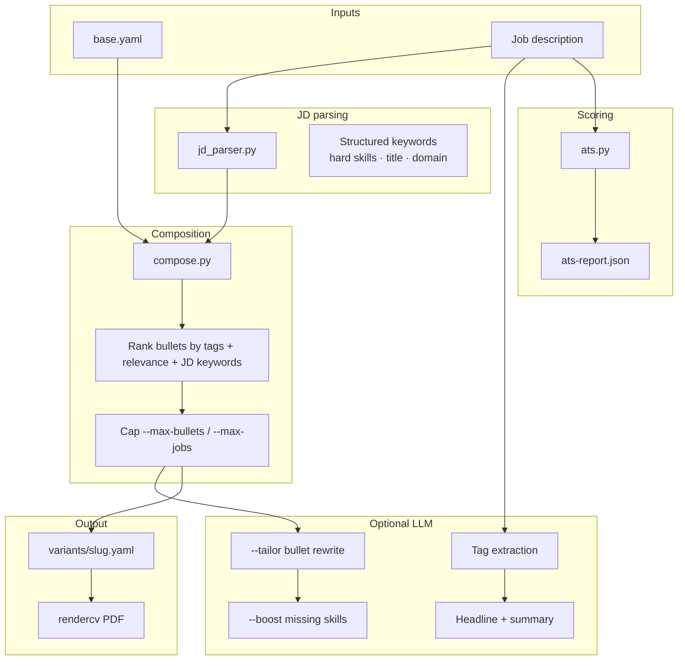

# Resume Quality Pipeline — Implementation Guide

> JD-driven composition, ATS scoring, LLM tailoring, and multi-role comparison.
> Implemented June 2026. Extends the base 3-layer system described in [`resume-system-implementation.md`](resume-system-implementation.md).

---

## Overview

The quality pipeline sits between **Layer 1** (`base.yaml`) and **Layer 3** (rendercv / DOCX). It makes resumes more **accurate** (verified facts only), **concise** (ranked + capped bullets), and **powerful** (JD-aligned headline, summary, and bullets).



---

## Module Reference

| Module | Purpose |
|---|---|
| [`compose.py`](../compose.py) | Shared bullet ranking, tag filtering, job selection, skills reorder |
| [`jd_parser.py`](../jd_parser.py) | Structured JD parse: hard skills, title keywords, domain, seniority |
| [`ats.py`](../ats.py) | Deterministic ATS score (/100) + multi-JD compare |
| [`resume.py`](../resume.py) | CLI: `build`, `analyze`, `score`, `compare` + LLM integration |
| [`transform.py`](../transform.py) | Uses `compose.py` for consistent bullet ranking with rendercv path |
| [`ui/backend/main.py`](../ui/backend/main.py) | WebUI API: `/api/jd/analyze`, `/api/jd/compare`, build with new flags |

---

## Composition (`compose.py`)

### Bullet ranking

Each bullet receives a score:

```
score = (tag_overlap × 10) + relevance_tier + (JD_keyword_hits × 5)
```

| `relevance` | Tier points |
|---|---|
| `high` | 3 |
| `medium` | 2 |
| `low` | 1 |

### Job selection

1. Include only jobs with `status: active`
2. Filter bullets by `--tags` (if set); fall back to all non-deprecated bullets when job-level tags match
3. Sort bullets by score (descending)
4. Cap at `--max-bullets` per job (default: 4)
5. Cap at `--max-jobs` total (default: 0 = unlimited)
6. Output newest jobs first

### Skills section

- Filtered by tags (same as before)
- With `--boost`: inject verified skills from `base.yaml` that match missing JD hard skills
- JD-matched skills are sorted to the front of each category row

---

## JD Parsing (`jd_parser.py`)

`parse_jd(text, base)` returns:

| Field | Description |
|---|---|
| `role_title` | First non-empty line of JD |
| `seniority` | `intern` / `junior` / `mid` / `senior` / `staff` / `principal` / … |
| `hard_skills` | Matched against known tech terms + skill names from `base.yaml` |
| `title_keywords` | Engineer, backend, fullstack, … |
| `domain_keywords` | fintech, ecommerce, saas, … |
| `all_keywords` | Weighted flat list used for bullet scoring (hard skills 2×) |

`keyword_match_report(parsed, base, tags)` compares JD hard skills against resume content and returns matched/missing skills plus top-scored bullets.

---

## ATS Scoring (`ats.py`)

Deterministic — no LLM required for grading.

| Dimension | Weight | Method |
|---|---|---|
| Keyword match | 40% | Hard skills from JD found in bullets + skills + headline/summary |
| Title alignment | 10% | Role title tokens appear in headline |
| Completeness | 20% | Summary, experience, skills, education present |
| Formatting | 20% | Full marks for rendercv path (ATS-safe by default) |
| Conciseness | 10% | Penalize bullets > 22 words |

Grades: A ≥ 85, B ≥ 75, C ≥ 65, D ≥ 50, F < 50.

Every `build` with `--jd` writes `output/{slug}/ats-report.json`.

---

## CLI Commands

### Recommended workflow

```bash
# 1. Compare multiple roles — decide apply order
python resume.py compare --jds-dir jds/

# 2. Deep-dive on one JD
python resume.py analyze --jd jds/target.txt

# 3. Check score before/after tuning
python resume.py score --jd jds/target.txt --tags backend,python --max-bullets 3

# 4. Full quality build
python resume.py build \
  --company "Acme" \
  --jd jds/target.txt \
  --llm --tailor --boost \
  --max-bullets 3 --max-jobs 4 \
  --template auto \
  --docx

# 5. Review artifacts
open output/acme-*/William_Jiang_CV.pdf
cat output/acme-*/ats-report.json
cat output/acme-*/bullet-diff.json    # when --tailor or --boost ran
```

### `python resume.py analyze`

Structured JD analysis against `base.yaml`.

| Flag | Description |
|---|---|
| `--jd` | Path to JD text file (required) |
| `--yaml` | Source YAML (default: `base.yaml`) |
| `--tags` | Optional tag filter for bullet ranking |
| `--json` | Output full JSON |

### `python resume.py score`

ATS compatibility score without building a PDF.

| Flag | Description |
|---|---|
| `--jd` | Path to JD text file (required) |
| `--tags` | Optional tag filter |
| `--max-bullets` | Bullets per job for composition preview (default: 4) |
| `--max-jobs` | Max experience entries (default: 0 = unlimited) |
| `--output` | Write JSON report to file |
| `--json` | Print JSON to stdout |

### `python resume.py compare`

Rank 2–5 JDs by resume fit.

| Flag | Description |
|---|---|
| `--jd` | One or more JD file paths |
| `--jds-dir` | Compare all `.txt` files in a directory |
| `--tags` | Optional tag filter |
| `--max-bullets` / `--max-jobs` | Same as score |
| `--output` / `--json` | Report output |

### `python resume.py build` — new flags

| Flag | Description |
|---|---|
| `--max-bullets N` | Max bullets per job (default: 4; 0 = unlimited) |
| `--max-jobs N` | Max experience entries (default: 0 = unlimited) |
| `--template auto` | Pick rendercv theme from JD signals |
| `--tailor` | LLM minimally rewrite selected bullets for JD (requires `--jd` + API key) |
| `--boost` | Second LLM pass: weave verified missing hard skills into bullets + skills (requires `--jd` + API key) |

Existing flags unchanged: `--llm`, `--jd`, `--docx`, `--cover-letter`, `--all-formats`, `--locale`.

---

## LLM Pipeline

Requires `DEEPSEEK_API_KEY` in `.env` (OpenAI-compatible; Ollama supported via `DEEPSEEK_BASE_URL`).

Set `LLM_PROVIDER=deepseek|kimi|minimax` to switch providers. See [`docs/llm-providers.md`](docs/llm-providers.md).

### Step 1 — Tag extraction (`--llm`)

LLM selects relevant tags from the tag inventory in `base.yaml`.

### Step 2 — Headline + summary (`--llm`)

- Headline: 1 line, 10–15 words, reflects target role
- Summary: **2 sentences, ≤ 45 words**, uses top-scored bullets only, no filler phrases

### Step 3 — Tailor (`--tailor`)

Rewrites selected bullets (max 22 words):

- Same facts — no invented employers, metrics, or tools
- Strong action verb, JD keywords woven naturally

Output: `output/{slug}/bullet-diff.json` (key → rewritten text).

### Step 4 — Boost (`--boost`)

Runs after tailor (or standalone):

1. Pre-score to find missing hard skills
2. Only boost skills **verified in base.yaml** (skills section or any bullet text)
3. Second LLM pass per bullet for verified missing keywords
4. Skills section: front-load JD-matched skills; add verified missing skills even if tag-filter excluded them

**Never fabricates experience.** If a JD requires Rust and Rust is not in `base.yaml`, it appears in `missing_skills` but is not added to the resume.

---

## Template auto-selection

`--template auto` rules (in `select_template_auto()`):

| Signal | Theme |
|---|---|
| FAANG company names in JD | `engineeringresumes` |
| Staff / principal / director seniority | `classic` |
| Startup / early-stage language | `moderncv` |
| ATS mentioned explicitly | `engineeringresumes` |
| Default | `sb2nov` |

---

## `base.yaml` Extensions

### Optional `variants` per bullet

Pre-written alternates — LLM picks/edits these instead of free-writing:

```yaml
- text: "Built REST APIs and backend workflows for GPU performance tracking"
  tags: [backend, python, api]
  status: active
  relevance: high
  variants:
    - "Built FastAPI REST APIs for real-time GPU/CPU tracking in Kubernetes"
    - "Optimized REST APIs and backend workflows supporting Kubernetes GPU monitoring"
```

Documented in the header comment of [`base.yaml`](../base.yaml).

---

## WebUI

Start: `./ui/start.sh` → http://localhost:5173

| Tab | Features |
|---|---|
| **Resume** | JD analysis panel (hard skills, missing, top bullets), max bullets/jobs, LLM, Tailor, Boost ATS, Auto theme |
| **Compare** | Paste 2–5 JDs, ranked fit table with scores and missing skills |
| **Transform** | RxResume sync (unchanged) |
| **History** | Run log (unchanged) |

### API endpoints

| Method | Path | Purpose |
|---|---|---|
| POST | `/api/jd/analyze` | Structured JD parse + match report |
| POST | `/api/jd/compare` | Multi-JD fit matrix |
| POST | `/api/resume/run` | Build with `tailor`, `boost`, `max_bullets`, `max_jobs` |

---

## Output Artifacts

For each build with `--jd`:

```
output/{slug}/
├── William_Jiang_CV.pdf
├── William_Jiang_CV.html          # if --all-formats
├── resume.docx                      # if --docx
├── cover-letter-{company}.txt       # if --cover-letter
├── ats-report.json                  # always (when --jd set)
└── bullet-diff.json               # when --tailor or --boost
```

`ats-report.json` structure:

```json
{
  "total": 95.6,
  "grade": "A",
  "breakdown": {
    "keyword_match": { "score": 40.0, "max": 40, "pct": 100 },
    "title_alignment": { "score": 10.0, "max": 10, "pct": 100 },
    "completeness": { "score": 20.0, "max": 20 },
    "formatting": { "score": 20, "max": 20 },
    "conciseness": { "score": 8.6, "max": 10 }
  },
  "skill_match": {
    "matched_skills": ["python", "kubernetes", "..."],
    "missing_skills": []
  },
  "top_bullets": [{ "job": "...", "text": "...", "score": 28 }]
}
```

---

## Design Principles

1. **Truth-first** — LLM selects and rephrases from `base.yaml`; never invents employers, dates, or metrics
2. **Deterministic scoring** — ATS grade is rule-based; LLM is not used to score
3. **Conciseness by default** — rank + cap beats dumping all tag-matching bullets
4. **Compare before apply** — use `compare` to prioritize which roles to invest tailoring time in
5. **LLM is additive** — `analyze`, `score`, `compare`, and manual `--tags` work without any API key

---

## Related Docs

- Architecture overview: [`overview.md`](overview.md)
- Base schema + original design: [`resume-system-implementation.md`](resume-system-implementation.md)
- RxResume path: [`rxresume-integration-guide.md`](rxresume-integration-guide.md)
- User identity: [`init.md`](init.md)
