# Resume Management System — Implementation Guide

> **See also:** [`resume-quality-pipeline.md`](resume-quality-pipeline.md) for the JD analysis, ATS scoring, bullet ranking, `--tailor`, `--boost`, and `compare` features added in June 2026.

> **The problem you have:** Multiple resume versions scattered across formats, conflicting/deprecated info (URLs, LinkedIn, cover letters), no tracking of what went to which job, and no clear way to pick the right template for a given role.
>
> **The solution:** A 3-layer system — one YAML base file you own, a composition script that assembles a job-specific version from it, and a renderer that outputs PDF + web. LLM is optional but adds JD analysis and cover letter drafting.

---

## Table of Contents

1. [System Overview](#1-system-overview)
2. [Layer 1 — Base YAML Schema](#2-layer-1--base-yaml-schema)
3. [Layer 2 — Composition Engine](#3-layer-2--composition-engine)
4. [Layer 3 — Rendering](#4-layer-3--rendering)
5. [Application Tracking Log](#5-application-tracking-log)
6. [LLM Integration (Optional)](#6-llm-integration-optional)
7. [Template Selection Guide](#7-template-selection-guide)
8. [Full Tech Stack](#8-full-tech-stack)
9. [MVP Build Plan (Weekend Sprint)](#9-mvp-build-plan-weekend-sprint)
10. [File & Folder Structure](#10-file--folder-structure)
11. [Migration: Consolidating Your Existing Resumes](#11-migration-consolidating-your-existing-resumes)

---

## 1. System Overview



```
┌─────────────────────────────────────────┐
│  LAYER 1 — Single source of truth       │
│  base.yaml  (all experience, all info,  │
│  every bullet, tagged + status-flagged) │
└───────────────────┬─────────────────────┘
                    │
                    ▼
┌─────────────────────────────────────────┐
│  LAYER 2 — Composition engine           │
│  Input: base.yaml + JD text             │
│  Output: job-specific variant YAML      │
│  Steps: filter → rank → select template │
│  (LLM optional for JD analysis)         │
└───────────────────┬─────────────────────┘
                    │
                    ▼
┌─────────────────────────────────────────┐
│  LAYER 3 — Rendering                    │
│  rendercv → PDF + HTML                  │
│  Reactive Resume → web URL (optional)   │
└─────────────────────────────────────────┘
                    │
                    ▼
┌─────────────────────────────────────────┐
│  TRACKING LOG                           │
│  applications.json — what went where,   │
│  which sections, which template, when   │
└─────────────────────────────────────────┘
```

**Key design decisions:**
- The base YAML is the only file you manually edit. Everything else is generated.
- Sections are tagged so the composition engine can filter intelligently.
- Every application creates a named snapshot: you can always reproduce exactly what you sent.
- LLM is additive — the system works without it, and you add it where it earns its cost.

---

## 2. Layer 1 — Base YAML Schema

This is your single source of truth. Every piece of information you've ever used in any resume lives here. Nothing gets deleted — items get marked `deprecated` or `conflicted` instead.

### 2.1 Full schema

```yaml
# base.yaml
meta:
  version: "1.0"
  last_updated: "2026-06-10"
  name: "William Chen"

# ─── IDENTITY ───────────────────────────────────────────────
identity:
  name: "William Chen"
  email: "william@example.com"
  phone: "+1-604-555-0123"
  location: "Vancouver, BC, Canada"

  # Multiple URLs — each has a status flag
  urls:
    - label: "GitHub"
      url: "https://github.com/williamchen"
      status: active          # active | deprecated | conflicted
      note: ""
    - label: "LinkedIn"
      url: "https://linkedin.com/in/williamchen"
      status: active
      note: ""
    - label: "Portfolio (old)"
      url: "https://williamchen-2023.vercel.app"
      status: deprecated
      note: "Replaced by new portfolio in 2025"
    - label: "Portfolio (current)"
      url: "https://williamchen.dev"
      status: active
      note: ""

  # Cover letter base — reusable opening + closing paragraphs
  cover_letter_base:
    opening: >
      I'm a full-stack developer with X years of experience building
      production systems in Python and TypeScript, currently based in
      Vancouver. I'm drawn to {company} because {reason_placeholder}.
    closing: >
      I'd welcome the chance to discuss how my background aligns with
      your team's goals. Thank you for your consideration.

# ─── EXPERIENCE ─────────────────────────────────────────────
experience:
  - company: "Acme Corp"
    title: "Senior Software Engineer"
    location: "Vancouver, BC"
    start: "2023-03"
    end: null                 # null = present
    status: active
    tags: [backend, python, node, typescript, monorepo, api]
    bullets:
      - text: "Led migration of 3 monorepo services from Express to Fastify, reducing p99 latency by 40%"
        tags: [backend, node, typescript, performance]
        status: active
        relevance: high       # high | medium | low
      - text: "Designed and shipped internal LLM tooling pipeline used by 12-person ML team"
        tags: [ai, python, backend]
        status: active
        relevance: high
      - text: "Mentored 2 junior engineers through quarterly OKR cycles"
        tags: [leadership, mentorship]
        status: active
        relevance: medium
      - text: "Maintained legacy PHP billing system (decommissioned Q4 2023)"
        tags: [php, legacy]
        status: deprecated
        relevance: low
        note: "Only include if applying to legacy modernisation roles"

  - company: "StartupXYZ"
    title: "Full-Stack Developer"
    location: "Remote"
    start: "2021-06"
    end: "2023-02"
    status: active
    tags: [fullstack, react, python, startup]
    bullets:
      - text: "Built customer-facing dashboard from scratch using React + FastAPI; used by 5k daily active users"
        tags: [frontend, react, python, fullstack]
        status: active
        relevance: high
      - text: "Reduced AWS costs by 30% by rightsizing EC2 instances and introducing S3 lifecycle policies"
        tags: [devops, aws, cost]
        status: active
        relevance: medium

# ─── SKILLS ─────────────────────────────────────────────────
skills:
  languages:
    - name: Python
      level: expert
      status: active
      tags: [backend, ai, scripting]
    - name: TypeScript
      level: expert
      status: active
      tags: [backend, frontend, node]
    - name: JavaScript
      level: expert
      status: active
      tags: [frontend, node]
    - name: PHP
      level: intermediate
      status: deprecated
      note: "Don't include unless role explicitly requires PHP"

  frameworks:
    - name: Node.js / Fastify
      status: active
      tags: [backend, node]
    - name: React
      status: active
      tags: [frontend]
    - name: FastAPI
      status: active
      tags: [backend, python]

  tools:
    - name: Git / GitHub
      status: active
      tags: [general]
    - name: Docker
      status: active
      tags: [devops]
    - name: AWS (EC2, S3, Lambda)
      status: active
      tags: [devops, aws]

# ─── PROJECTS ────────────────────────────────────────────────
projects:
  - name: "PromptVault"
    url: "https://github.com/williamchen/promptvault"
    description: "Chrome extension for capturing and organizing AI prompts across ChatGPT, Claude, Gemini"
    tags: [chrome-extension, typescript, ai, side-project]
    status: active
    relevance: high
    bullets:
      - text: "Manifest V3 extension with IndexedDB local-first storage, multi-provider LLM optimization"
        tags: [typescript, ai, chrome-extension]
        status: active

# ─── EDUCATION ───────────────────────────────────────────────
education:
  - institution: "University of British Columbia"
    degree: "B.Sc. Computer Science"
    graduation: "2021"
    status: active
    tags: [general]

# ─── COVER LETTER TEMPLATES ──────────────────────────────────
cover_letters:
  - id: "backend-focused"
    label: "Backend / API roles"
    tags: [backend, python, node]
    body: >
      {opening}
      
      In my most recent role at Acme Corp, I led the re-architecture of three
      core API services, cutting latency by 40% while maintaining 99.9% uptime.
      I work primarily in Python and TypeScript, with a strong preference for
      well-tested, well-documented codebases.
      
      {closing}

  - id: "fullstack-focused"
    label: "Full-stack / product roles"
    tags: [fullstack, react, frontend]
    body: >
      {opening}
      
      I've shipped customer-facing products end-to-end — from React dashboards
      to FastAPI backends — and I'm comfortable owning a feature from design
      through deployment.
      
      {closing}
```

### 2.2 Status flag rules

| Flag | Meaning | Include by default? |
|---|---|---|
| `active` | Current, accurate, worth including | Yes |
| `deprecated` | Old info, no longer accurate | No — unless role specifically needs it |
| `conflicted` | Two versions exist, needs resolution | Never — fix before including |

---

## 3. Layer 2 — Composition Engine

The composition script reads `base.yaml`, takes a job description, and outputs a lean `variant.yaml` that only contains the sections and bullets relevant to that role.

### 3.1 CLI usage

```bash
# Basic — manual section selection
python resume.py build --company "BestIT" --role "SWE" --tags backend,python,typescript --template clean

# With LLM analysis (optional)
python resume.py build --company "BestIT" --role "SWE" --jd jds/bestit-swe.txt --llm --template clean

# Output DOCX alongside PDF
python resume.py build --company "BestIT" --role "SWE" --tags backend,python --docx

# Chinese resume with CJK font
python resume.py build --company "BestIT" --role "SWE" --tags backend,python --locale zh-CN --yaml base_zh.yaml

# Cover letter during build
python resume.py build --company "BestIT" --role "SWE" --tags backend,python --cover-letter

# All together
python resume.py build --company "BestIT" --role "SWE" --tags backend,python --docx --cover-letter --locale zh-CN

# List all available tags in your base
python resume.py tags

# Show all applications logged
python resume.py log
```

### 3.2 Full Python script (`resume.py`)

The composition engine is implemented in `resume.py` at the repo root. The spec version below captures the design intent; the actual file evolves with the project and may include additional features (headline/photo/summary mapping, phone normalization, username extraction, rendercv 2.x design schema, etc.).

**Always read the actual `resume.py` file** for the canonical implementation. The key functions and their purposes:

| Function | Purpose |
|---|---|
| `load_base()` | Read and parse a YAML file (default: `base.yaml`) |
| `filter_by_tags()` | Filter items by tag list + status flags |
| `build_variant()` | Assemble a rendercv-compatible variant dict from filtered base data |
| `write_variant()` | Serialize variant dict to `variants/<slug>.yaml` |
| `render_variant()` | Shell out to `rendercv render` to produce PDF (and optionally HTML/Markdown/PNG) |
| `generate_docx()` | Build a .docx Word document from the variant YAML using `python-docx` |
| `log_application()` | Append build metadata to `applications.json` |
| `llm_extract_tags()` | Optional — call DeepSeek/OpenAI API to suggest tags from a JD |
| `llm_generate_headline()` | Optional — generate a role-specific headline from a JD |
| `llm_generate_summary()` | Optional — rewrite the summary to match a target role |
| `llm_rewrite_cover_letter()` | Optional — tailor the cover letter body to a specific JD |
| `cmd_cover_letter()` | Generate a standalone cover letter (CLI subcommand) |
| `_generate_cover_letter()` | Generate a cover letter during `resume.py build --cover-letter` |

**Variant mapping** (`build_variant()` produces a two-key dict):

```yaml
cv:
  name, email, phone, location   # from identity
  headline                       # from identity.headline
  photo                          # from identity.photo (resolved relative to variant)
  social_networks                # active URLs, username extracted
  sections:
    Summary                      # from base.summary (if present)
    experience                   # active jobs, bullets filtered by tags, newest-first
    skills                       # grouped by category, filtered by tags
    projects                     # active, tag-filtered
    education                    # all active entries
design:
  theme                          # from --template (default: classic)
  page, colors, typography       # see Section 4.1 for rendercv 2.x schema
```

---

## 4. Layer 3 — Rendering

### 4.1 rendercv (primary renderer)

rendercv takes your variant YAML and outputs a PDF and an HTML version.

```bash
# Install
pip install rendercv

# Render a variant
rendercv render variants/bestit-swe-202606.yaml

# Output: a folder with PDF + HTML
```

rendercv has several built-in themes. Match theme to role type:

| Theme | Best for |
|---|---|
| `classic` | FAANG, large tech, senior roles |
| `sb2nov` | Standard SWE roles, ATS-friendly |
| `moderncv` | Startup, product, mid-level |
| `engineeringresumes` | Maximally ATS-optimised |

Set the theme in your variant YAML:

```yaml
design:
  theme: classic
  page:
    size: us-letter
    top_margin: 0.7in
    bottom_margin: 0.7in
    left_margin: 0.7in
    right_margin: 0.7in
  colors:
    name: rgb(0,79,144)
    headline: rgb(0,79,144)
    connections: rgb(0,79,144)
    section_titles: rgb(0,79,144)
  typography:
    font_family: Source Sans 3
    font_size:
      body: 10pt
      name: 30pt
      headline: 10pt
      connections: 10pt
      section_titles: 1.4em
```

### 4.2 DOCX (Word) Output

Introduced 2026-06-12. Generates a recruiter-ready .docx file alongside (or instead of) the PDF.

```bash
python resume.py build --company "BestIT" --role "SWE" --tags backend,python --docx
# Output: output/<slug>/resume.docx
```

**Key features:**
- Section-based layout: headings → bullet lists under each experience
- **Calibri 11pt body, 14pt bold headings** — universal on Windows/Mac, renders correctly in Google Docs
- Single `python-docx` dependency — no LaTeX or browser rendering needed
- Font auto-switches to **Noto Sans SC** when `--locale zh-CN` is set
- Programmatic generation: section order, bullet indentation, metadata fields all match the PDF variant

### 4.3 Reactive Resume (optional visual layer)

If you want a GUI editor or a shareable web URL on top of the same data:

1. Go to [rxresu.me](https://rxresu.me) — create a free account
2. Import your variant YAML (or enter manually)
3. Pick a template and tweak visually
4. Export PDF or copy the public URL (e.g. `rxresu.me/w/bestit-2026`)

Use Reactive Resume for roles where you want to send a live web link (e.g. in your cold email signature). Use rendercv for the PDF that goes through ATS systems.

---

## 5. Application Tracking Log

Every time you run `resume.py build`, it appends to `applications.json`:

```json
{
  "applications": [
    {
      "id": "bestit-senior-swe-202606",
      "company": "BestIT",
      "role": "Senior Software Engineer",
      "date": "2026-06-10",
      "tags_used": "backend,python,typescript,api",
      "template": "classic",
      "jd_source": "jds/bestit-swe.txt",
      "variant_file": "variants/bestit-senior-swe-202606.yaml",
      "output_dir": "output/bestit-senior-swe-202606",
      "status": "applied",
      "notes": ""
    }
  ]
}
```

You can add `status` and `notes` fields manually after applying:

```json
"status": "phone screen booked",
"notes": "Spoke with recruiter Sarah. Focus on distributed systems in interview."
```

---

## 6. LLM Integration (Optional)

LLM is useful at two specific steps. Neither is required — add them when the manual version becomes slow.

### Step A — JD analysis (tag extraction + bullet scoring)

**When to add it:** When you're applying to 5+ different role types and manually picking tags feels slow.

**Prompt template:**

```
Given this job description, do two things:
1. From this list of tags: {all_tags}, select the most relevant ones (comma-separated).
2. Score each of these resume bullets 0-10 for relevance to the JD:
   {bullets}

Return JSON only:
{"tags": "backend,python,api", "scores": {"bullet_id": 8, ...}}
```

**Recommended model:** DeepSeek V4 (`deepseek-v4-pro`) via OpenAI-compatible API. ~$0.001 per JD analysis. Add `DEEPSEEK_API_KEY` to `.env` file (loaded automatically by `python-dotenv`).

**Alternative free option:** Gemini 2.0 Flash — free tier is generous enough for personal use.

**Local / private option:** Ollama with Llama 3.1 8B. Zero cost, runs on your M3 Pro. Slightly lower quality but perfectly fine for tag extraction.

```bash
# Install Ollama
brew install ollama
ollama pull llama3.1

# Use by setting these in .env (no code changes needed):
# DEEPSEEK_BASE_URL=http://localhost:11434/v1
# DEEPSEEK_API_KEY=ollama
# DEEPSEEK_MODEL=llama3.1
```

### Step B — Cover letter drafting

**When to add it:** Every time you apply. This is where LLM earns its keep most clearly.

**Workflow:**

1. Paste JD into prompt
2. LLM reads your `cover_letter_base` from `base.yaml` and selects the closest cover letter template
3. Fills in `{company}`, `{reason_placeholder}`, and tailors 1-2 body paragraphs
4. You review and send

**Prompt template:**

```
Here is my cover letter base:
{cover_letter_base.opening}
{cover_letters[best_match].body}
{cover_letter_base.closing}

And the job description:
{jd_text}

Write a tailored cover letter. Keep my voice. Adjust {reason_placeholder} to be specific 
to this company. Tighten the body to 2 paragraphs max. Output plain text only.
```

---

## 7. Template Selection Guide

Use this to pick a template before running the build command.

| Role type | Seniority | Template | Renderer |
|---|---|---|---|---|
| Backend SWE, FAANG | Senior / Staff | `classic` (rendercv) | rendercv PDF + optional DOCX |
| Full-stack, startup | Mid / Senior | `moderncv` or Reactive Resume | PDF + web URL + optional DOCX |
| Dev / any role, ATS priority | Any | `engineeringresumes` | rendercv PDF + optional DOCX |
| Freelance / consulting | Any | Reactive Resume | Web link + PDF + optional DOCX |
| Academic / research | Any | Awesome-CV (LaTeX) | PDF only |

**Decision rule for template:**

```
Is the company > 500 people?
  YES → prioritise ATS safety → classic or engineeringresumes
  NO  → visual design matters more → moderncv or Reactive Resume

Does the JD mention "PhD" or "research"?
  YES → Awesome-CV (LaTeX)

Do you want to send a web link in a cold email?
  YES → Reactive Resume (gives you rxresu.me/yourname/role URL)
```

---

## 8. Full Tech Stack

### Required (core system — no LLM, no cost)

| Component | Tool | Why |
|---|---|---|
| Data store | YAML + Git | Plain text, diffable, version-controlled |
| Composition | Python script (`resume.py`) | Reads base, filters by tags, writes variant |
| PDF + HTML rendering | rendercv | YAML in → clean PDF + HTML out |
| DOCX Word output | python-docx | Build recruiter-ready .docx from variant YAML |
| Application tracking | `applications.json` | Simple, no database needed |

### Optional (add as needed)

| Component | Tool | When to add |
|---|---|---|
| Visual editor | Reactive Resume | When you want a GUI or web URL |
| JD analysis | DeepSeek V4 / Gemini Flash / Ollama | When manual tag selection feels slow |
| Cover letter drafting | Any LLM | Every application — high ROI |
| Local web dashboard | FastAPI + React/Vite (in `ui/`) | When the CLI log is hard to browse |
| Chinese/CJK locale | Noto Sans SC font + `--locale zh-CN` | When applying to Chinese-language roles |

### LLM cost comparison

| Provider | Model | Cost per resume | Privacy |
|---|---|---|---|
| DeepSeek | deepseek-v4-pro | ~$0.001 | Cloud |
| Google | Gemini 2.0 Flash | Free tier | Cloud |
| Ollama | Llama 3.1 8B | Free (local) | Local |
| OpenAI | GPT-4o mini | ~$0.01 | Cloud |
| Anthropic | Claude Haiku | ~$0.01 | Cloud |

**Recommendation:** Start with Gemini Flash (free) or DeepSeek (near-free). Upgrade to a stronger model only for final cover letter polish.

### Dependencies

```bash
# Python dependencies
pip install pyyaml rendercv python-docx

# Optional: LLM integration (OpenAI-compatible client + .env loading)
pip install openai python-dotenv

# Optional: WebUI
pip install fastapi uvicorn; npm install  # in ui/backend/ and ui/frontend/ respectively

# Optional: Ollama for local LLM
brew install ollama && ollama pull llama3.1
```

---

## 9. MVP Build Plan (Weekend Sprint)

Build the minimum system that solves your actual problem. Do this in order.

### Day 1 — Data layer (3–4 hours)

**Goal:** One base YAML that replaces all your existing resume files.

1. Create `base.yaml` using the schema in Section 2
2. Pull content from your existing 4–7 resumes — paste the best version of each bullet
3. Tag each bullet (use the tag list from `python resume.py tags` once you have a draft)
4. Flag deprecated/conflicted items rather than deleting them
5. Add all URLs, both active and old, with status flags
6. Add at least one cover letter base template

**Test:** Can you open `base.yaml` and find anything you'd want on a resume? Yes → done.

### Day 1 — Composition script (1–2 hours)

1. Copy `resume.py` from Section 3 into your project folder
2. Run: `python resume.py tags` — you should see all your tags listed
3. Run a test build:
   ```bash
   python resume.py build --company "Test Co" --role "SWE" --tags backend,python
   ```
4. Check that `variants/test-co-swe-YYYYMM.yaml` was created with filtered content

### Day 2 — Rendering (1 hour)

1. Install rendercv: `pip install rendercv`
2. Add `design:` block to your variant YAML (see Section 4)
3. Run: `rendercv render variants/test-co-swe-YYYYMM.yaml`
4. Open the generated PDF. Adjust the theme if needed.

### Day 2 — First real application (1 hour)

1. Save a real JD as `jds/company-role.txt`
2. Run:
   ```bash
   python resume.py build \
     --company "BestIT" \
     --role "Senior SWE" \
     --tags backend,python,typescript,api \
     --template classic \
     --jd jds/bestit-swe.txt
   ```
3. Check the PDF. Check `applications.json`. You now have a tracked, reproducible application.

### Week 2 — Add LLM (optional, 1–2 hours)

1. Sign up for DeepSeek API (or use Gemini free tier)
2. Install deps: `pip install openai python-dotenv`
3. Add `DEEPSEEK_API_KEY=sk-...` to `.env` (auto-loaded by `python-dotenv` via `load_dotenv()`)
4. Run: `python resume.py build --company X --role Y --jd jds/x.txt --llm`
5. Compare the LLM-suggested tags to what you'd have picked manually. Adjust prompt if needed.

---

## 10. File & Folder Structure

```
resume-system/
├── base.yaml                  # Single source of truth (edit this)
├── resume.py                  # Composition engine CLI
├── applications.json          # Application tracking log (auto-generated)
│
├── jds/                       # Job descriptions (paste JD text here)
├── variants/                  # Auto-generated per-application YAMLs
├── output/                    # Auto-generated PDFs + DOCX + HTML
│   ├── bestit-swe-202606/
│   │   ├── William_Chen_CV.pdf
│   │   ├── William_Chen_CV.html
│   │   └── resume.docx
│   └── shopify-staff-eng-202607/
│       └── resume.docx
│
├── scripts/
│   └── cleanup.sh             # Reset generated data (variants, output, runs.db)
│
├── ui/                        # WebUI (FastAPI + React/Vite)
│   ├── start.sh               # One-command launcher
│   ├── backend/
│   │   ├── main.py            # FastAPI server (~150 lines)
│   │   └── models.py          # Pydantic request/response models
│   └── frontend/
│       ├── src/
│       │   ├── App.tsx        # Router
│       │   ├── pages/
│       │   │   ├── ResumePage.tsx  # Main build form
│       │   │   └── HistoryPage.tsx # Application log viewer
│       │   └── types.ts       # TypeScript request/response types
│       ├── package.json
│       └── index.html
│
├── docs/
│   ├── overview.md
│   ├── resume-system-implementation.md
│   ├── rxresume-integration-guide.md
│   └── superpowers/
│       ├── specs/
│       └── plans/
│
└── .gitignore                 # See below
```

### `.gitignore`

```
output/          # Large binary files — regenerate anytime
.env             # API keys
__pycache__/
*.pyc
.ui_temp_id.txt  # VSCode temp file
```

**Commit to git:** `base.yaml`, `resume.py`, `transform.py`, `applications.json`, `variants/`, `jds/`, `runs.db`, `ui/`

**Do not commit:** `output/` (PDFs/DOCX — regenerate anytime), `.env` (API keys), `__pycache__/`, `.ui_temp_id.txt`

---

## 11. Migration: Consolidating Your Existing Resumes

You have 4–7 versions in mixed formats. Here's how to consolidate them without losing anything.

### Step 1 — Collect all versions

Gather every resume file you have. Open them all at once.

### Step 2 — For each section, pick the canonical version

Go through each experience entry across all files. For each bullet:
- If the wording is identical or similar → keep the clearest version, mark `status: active`
- If one version is from 2023 and outdated → mark `status: deprecated`, keep the text, add a `note`
- If two versions contradict each other (different claims) → mark `status: conflicted`, add a `note` explaining which is correct, then fix

### Step 3 — Resolve URL conflicts

You mentioned conflicting URLs. For each URL type (LinkedIn, portfolio, etc.):
- Find the most current one → `status: active`
- All others → `status: deprecated` with a note about when it was active
- If you're genuinely unsure which LinkedIn URL is current → check your LinkedIn profile and use the one that matches

### Step 4 — Verify with a test build

Run a test build with broad tags (`--tags backend,python,typescript`) and check the output PDF. If anything looks wrong, fix `base.yaml` and re-run. The script is deterministic — same input, same output, every time.

---

## Quick Reference

```bash
# See all available tags
python resume.py tags

# Build a variant (manual tags)
python resume.py build --company "BestIT" --role "Senior SWE" --tags backend,python,api --template classic

# Build a variant (with JD file)
python resume.py build --company "Shopify" --role "Staff Eng" --jd jds/shopify.txt --tags backend,python

# Build with LLM tag suggestion
python resume.py build --company "BestIT" --role "Senior SWE" --jd jds/bestit.txt --llm

# Build with DOCX output
python resume.py build --company "BestIT" --role "Senior SWE" --tags backend,python --docx

# Build with cover letter
python resume.py build --company "BestIT" --role "Senior SWE" --tags backend,python --cover-letter

# Build Chinese resume
python resume.py build --company "BestIT" --role "Senior SWE" --tags backend,python --locale zh-CN --yaml base_zh.yaml

# View application history
python resume.py log

# Render a variant manually
rendercv render variants/bestit-senior-swe-202606.yaml
```

---

*Generated: 2026-06-10 | Updated: 2026-06-12 | System designed for Python 3.11+, rendercv 2.x, python-docx 1.x, optional DeepSeek/Gemini/Ollama LLM integration*
